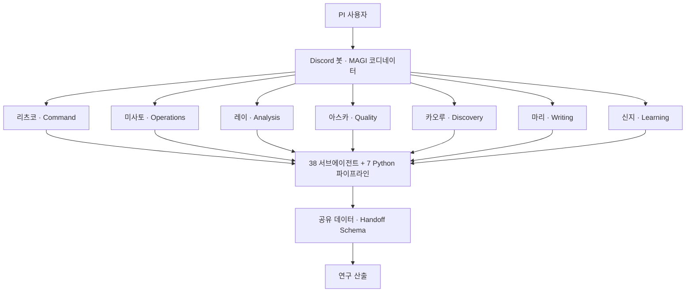

<div align="center">


# NERV 시스템 백서

**학술 연구를 지원하는 45개 에이전트 멀티에이전트 시스템의 아키텍처 백서**

[](https://taehyeonglim.github.io/nerv-whitepaper/)
[](https://taehyeonglim.github.io/nerv-whitepaper/02-architecture/)
[](https://taehyeonglim.github.io/nerv-whitepaper/03-characters/)
[](https://squidfunk.github.io/mkdocs-material/)

### 📖 **[https://taehyeonglim.github.io/nerv-whitepaper/](https://taehyeonglim.github.io/nerv-whitepaper/)**

</div>

---

**NERV**는 1인 연구실(PI)의 학술 연구를 자동화·증폭하는 멀티에이전트 시스템입니다.
에반게리온의 특무기관 *NERV*와 3대 슈퍼컴퓨터 *MAGI*를 모티프로, **7명의 캐릭터(역할)**가
에이전트를 소유하고 Discord 봇이 디스패치하며, MAGI 사상의 **자율 교차검증**으로 품질을 지킵니다.



## 이 백서가 담는 것

| | |
|---|---|
| **38 서브에이전트 전수** | 각 에이전트의 작동 방식을 플로우차트로 수록 + 입출력 계약 |
| **7 캐릭터(역할)** | 캐릭터 소유 모델 · 도메인 · 핸드오프 |
| **교차 시스템** | MAGI Gate · MAGI Patrol(24h 순찰) · Handoff Schema · 품질 게이트 · launchd 42 잡 |
| **모델 전략** | Opus 4.8 / Sonnet 4.6 / Haiku 4.5 + Codex(gpt-5.5) 강제위임 16 |

> 본 백서는 시스템 **구조**만 기술합니다. 진행 중인 연구의 데이터·결과·참가자 정보는 포함하지 않습니다.

## 로컬 미리보기

```bash
pip install mkdocs-material
mkdocs serve   # http://127.0.0.1:8000
```

## 빌드 & 배포

`main` 브랜치 push 시 GitHub Actions가 `mkdocs build --strict` 후 GitHub Pages로 배포합니다
(`.github/workflows/deploy.yml`).

---

<div align="center">
<sub>© 2026 Taehyeong Lim · NERV Multi-Agent Research System · 이미지는 gpt-image(gpt-5.5)로 생성, 다이어그램은 Mermaid</sub>
</div>
