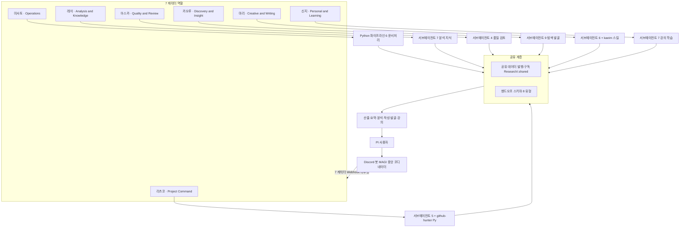

# 2 · 시스템 아키텍처


NERV는 **45개 에이전트**로 구성된 멀티에이전트 시스템입니다. 한 명의 PI(연구 책임자)가
Discord 봇 하나로 7명의 캐릭터(역할)를 호출하면, 각 캐릭터가 소유한 전문 에이전트들이
작업을 수행하고, 그 결과가 공유 데이터 계층과 핸드오프 스키마를 거쳐 흐릅니다.

이 장은 그 전체 지도를 **레이어 구조**로 펼쳐 보여줍니다.

---

## 2.1 인벤토리 한눈에

!!! note "45 = 38 + 7"
    - **38 Claude 서브에이전트** — `.claude/agents/*.md`에 정의된 NLG·추론 중심 에이전트
    - **7 Python 파이프라인** — `scripts/` 아래 실행되는 결정론적 처리기 (미사토 6 + 리츠코 github-hunter 1)
    - **합계 45** — 검증: `python3 scripts/check_agent_inventory.py`

`Agents/{캐릭터}/*/SKILL.md`는 메타·워크플로우 문서 전용이며, 실제 실행 정의는
`.claude/agents/` 쪽만 런타임에 로드됩니다. 인벤토리 카운트는 위 스크립트가 SSOT로 검증하여
문서·정의·설정 사이의 드리프트를 자동 감지합니다.

---

## 2.2 레이어 구조

PI의 요청은 위에서 아래로 흐르고, 산출물은 공유 계층을 거쳐 다시 소비됩니다.



**흐름 해설**

1. **PI → Discord 봇** — 모든 요청의 단일 진입점. 봇은 MAGI 중앙 코디네이터로서 요청을 분석해
   적합한 캐릭터로 라우팅합니다.
2. **봇 → 7 캐릭터** — 캐릭터별 Webhook으로 분기되어, 각 역할이 자기 도메인의 작업만 받습니다.
3. **캐릭터 → 소유 에이전트** — 각 캐릭터는 자기가 소유한 서브에이전트(또는 미사토의 Python
   파이프라인)를 디스패치합니다.
4. **에이전트 → 공유 계층** — 산출물은 `Research/.shared/`에 발행-구독 모델로 게시되고, 역할 간
   교환은 핸드오프 스키마(8 유형)로 표준화됩니다.
5. **공유 계층 → 산출 → PI** — 요약·분석·작성·발굴·강의 등 최종 산출물이 PI에게 전달됩니다.

---

### 같은 구조 — HTML/CSS 프로토타입 (비교용)

> 아래는 위 Mermaid 다이어그램과 **동일한 구조**를 HTML/CSS로 직접 구현한 버전입니다.
> NERV 크림슨 브랜딩 · 캐릭터 아바타 · hover 효과를 적용했습니다. 두 방식을 비교해 보세요.

<div class="nerv-arch">
  <div class="nerv-arch-tier">
    <span class="nerv-arch-label">진입점</span>
    <div class="nerv-arch-row">
      <div class="nerv-arch-node node-pi">PI 사용자<small>모든 요청의 단일 진입점</small></div>
    </div>
  </div>
  <div class="nerv-arch-flow">↓</div>
  <div class="nerv-arch-tier">
    <span class="nerv-arch-label">오케스트레이션</span>
    <div class="nerv-arch-row">
      <div class="nerv-arch-node node-bot">Discord 봇 · MAGI 중앙 코디네이터<small>요청 분석 후 7 캐릭터 Webhook으로 라우팅</small></div>
    </div>
  </div>
  <div class="nerv-arch-flow">↓<span>7 캐릭터(역할)로 분기</span></div>
  <div class="nerv-arch-tier">
    <span class="nerv-arch-label">7 캐릭터 · 역할별 에이전트 소유</span>
    <div class="nerv-arch-row nerv-arch-chars">
      <div class="nerv-arch-char"><b>리츠코</b><span>Project Command</span><em>5 + 1 Py</em></div>
      <div class="nerv-arch-char"><b>미사토</b><span>Operations</span><em>6 Py</em></div>
      <div class="nerv-arch-char"><b>레이</b><span>Analysis · Knowledge</span><em>7</em></div>
      <div class="nerv-arch-char"><b>아스카</b><span>Quality · Review</span><em>4</em></div>
      <div class="nerv-arch-char"><b>카오루</b><span>Discovery · Insight</span><em>9</em></div>
      <div class="nerv-arch-char"><b>마리</b><span>Creative · Writing</span><em>6 + skill</em></div>
      <div class="nerv-arch-char"><b>신지</b><span>Personal · Learning</span><em>7</em></div>
    </div>
  </div>
  <div class="nerv-arch-flow">↓<span>산출물 발행 · 역할 간 핸드오프</span></div>
  <div class="nerv-arch-tier">
    <span class="nerv-arch-label">공유 계층</span>
    <div class="nerv-arch-row">
      <div class="nerv-arch-node node-shared">발행–구독<small>Research/.shared</small></div>
      <div class="nerv-arch-node node-shared">핸드오프 스키마<small>8 유형</small></div>
    </div>
  </div>
  <div class="nerv-arch-flow">↓</div>
  <div class="nerv-arch-tier">
    <span class="nerv-arch-label">산출</span>
    <div class="nerv-arch-row">
      <div class="nerv-arch-node node-out">요약 · 분석 · 작성 · 발굴 · 강의 → PI</div>
    </div>
  </div>
</div>

---

## 2.3 캐릭터별 소유 에이전트

7명의 캐릭터가 명확한 도메인 경계로 에이전트를 나누어 소유합니다.

| 캐릭터 | 역할 도메인 | 소유 에이전트 수 |
|--------|-------------|------------------|
| **리츠코** (아카기 리츠코) | Project Command | 5 Claude + 1 Python (github-hunter) |
| **미사토** (카츠라기 미사토) | Operations | 6 Python (문서 처리) |
| **레이** (아야나미 레이) | Analysis & Knowledge | 7 Claude |
| **아스카** (소류 아스카 랑그레이) | Quality & Review | 4 Claude |
| **카오루** (나기사 카오루) | Discovery & Insight | 9 Claude |
| **마리** (마키나미 마리) | Creative & Writing | 6 Claude + 1 스킬 (kaeim-formatter) |
| **신지** (이카리 신지) | Personal & Learning | 7 Claude |

> 미사토의 6개는 모두 GPU·API 호출 등 결정론적 처리에 특화된 **Python 파이프라인**입니다.
> 마리의 kaeim-formatter는 에이전트 카운트와 별도인 **스킬**(서식 자동 편집)로, 인벤토리 45에는
> 포함되지 않습니다.

각 캐릭터의 기능을 일반적 수준에서 요약하면 다음과 같습니다.

- **리츠코** — 연구 아이디어 토론, 프로젝트 일정 추적, 연구비 예산 관리, GitHub 저장소 도입 평가,
  외부 에이전트 설치, 저장소 자동 발굴.
- **미사토** — PDF→Markdown 변환, 변환 품질 검사, DOI 식별, 인용 추출, 그림·표 추출,
  파이프라인 오케스트레이션.
- **레이** — 논문 요약, 방법론 분석, 키워드·태그 추천, 자동 백링크, 위키 복리 갱신,
  라이브러리 정합성 감시, 단일 논문 통독 브리프.
- **아스카** — 학술 문체 검사, 연구 갭 식별, 재투고 응대 지원, 질적 데이터 주제 분석.
- **카오루** — 관련 논문 검색, 인용 네트워크 분석, 연구 동향 분석, 심층 자료 탐색, 일일 논문 추천,
  논문-코드 정합성 감사, 다중 소스 비교, 원고 인용 정합성 감사, 통계 수치 정합성 감사.
- **마리** — 서론·방법·결과·논의 섹션 작성, 초록 생성, IRB 문서 작성, 학회지 서식 편집(스킬).
- **신지** — 강의 내러티브 합성, 강의 웹 자료 검색, HTML 슬라이드 제작, 나레이션 대본 작성,
  iMotions 센서 전문 조회, 강의 콘텐츠 설계, 이미지 생성.

---

## 2.4 디렉토리 구조 개요

시스템은 크게 네 갈래로 나뉩니다 — 에이전트 정의, 연구 데이터·산출, Discord 봇, 실행 스크립트.

```text
NERV/
├── Agents/                     # 캐릭터별 에이전트 정의 + 역할 문서
│   ├── Lab Director/           #   메타 오케스트레이션 (설정·감사·프로토콜)
│   ├── ritsuko/ … shinji/      #   7 캐릭터 디렉토리 (각 에이전트 SKILL.md)
│   ├── ROLE-*.md               #   역할 정의서 7
│   └── HANDOFF_SCHEMA.yaml      #   역할 간 데이터 교환 스키마
│
├── Research/                   # 연구 산출·공유 데이터
│   ├── Analysis/               #   요약·방법론·질적 분석 결과
│   ├── Wiki/                   #   Knowledge Wiki (개념 복리 축적)
│   ├── Library/                #   논문 라이브러리
│   └── .shared/                #   역할 간 공유 데이터 (발행-구독)
│
├── discord-claude-bot/         # MAGI 중앙 코디네이터
│   ├── bot.py                  #   1봇 + 7 캐릭터 Webhook 라우팅
│   └── requirements.txt
│
└── scripts/                    # 실행 스크립트·Python 파이프라인
    ├── (미사토 문서처리 6)      #   PDF 변환·DOI·인용·그림표 등
    ├── github-hunter/          #   리츠코 저장소 발굴 파이프라인
    ├── magi-patrol/            #   24h 자율 순찰
    └── _lib/                   #   공통 유틸리티
```

> 실제 에이전트 실행 정의는 `.claude/agents/*.md`에 있고, `Agents/{캐릭터}/*/SKILL.md`는
> 메타·워크플로우 문서입니다. 두 위치는 인벤토리 스크립트가 교차 검증합니다.

---

## 2.5 모델 배정 요약

NERV는 작업 성격에 따라 모델을 차등 배정합니다. NLG·추론은 Claude 계열, 결정론적 문서 처리는
Python, 종합·분류 단계는 Codex(gpt-5.5)로 위임합니다.

| 계층 | 모델 | 개수 | 용도 |
|------|------|------|------|
| 오케스트레이터·고급 생성 | **Claude Opus 4.8** | 9 서브에이전트 | 다회차 추론, 고급 작성, 조율 |
| NLG·추론 중심 | **Claude Sonnet** | 25 서브에이전트 | 분석·검토·탐색·작성 |
| 구조화 추출·plumbing | **Claude Haiku** | 4 서브에이전트 | 결정론적 추출·설치 |
| 문서 처리 파이프라인 | **Python** | 7 파이프라인 | GPU 변환·API 조회·품질 검사 |

> 38 Claude 서브에이전트 = Opus 9 + Sonnet 25 + Haiku 4.

**Codex(gpt-5.5) 강제 위임 — 16 에이전트**

GPT 쿼터를 적극 활용하기 위해, **16개 에이전트**의 종합·분류 단계는 Codex(gpt-5.5)로
**강제 위임**됩니다. 파일 입출력·인용 검증·할루시네이션 방지 같은 정확성 핵심 단계는 원래의
Claude 모델이 그대로 담당하고, 자연어 종합/분류처럼 GPT가 유리한 단계만 위임하는 **하이브리드**
구조입니다. Codex CLI 미설치·타임아웃 등 시스템 오류 시에만 Claude로 폴백합니다.

위임 대상은 레이·카오루·아스카의 분석·탐색·검토 에이전트와 리츠코의 평가 에이전트, 그리고
마리의 영문 작성 에이전트 일부에 걸쳐 있습니다.

---

## 2.6 정리

- NERV는 **45 에이전트**(38 Claude + 7 Python)를 7 캐릭터가 도메인별로 소유하는 구조입니다.
- 모든 요청은 **Discord 봇(MAGI 중앙 코디네이터)** 단일 진입점을 거쳐 캐릭터로 라우팅됩니다.
- 역할 간 산출물은 **공유 데이터 계층(발행-구독)**과 **핸드오프 스키마(8 유형)**로 흐릅니다.
- 모델은 **Opus 9 / Sonnet 25 / Haiku 4 + Python 7**로 차등 배정하고, **16 에이전트**는
  Codex(gpt-5.5)로 종합 단계를 강제 위임합니다.

다음 장에서는 7 캐릭터의 역할 매트릭스와 도메인을 자세히 다룹니다.
