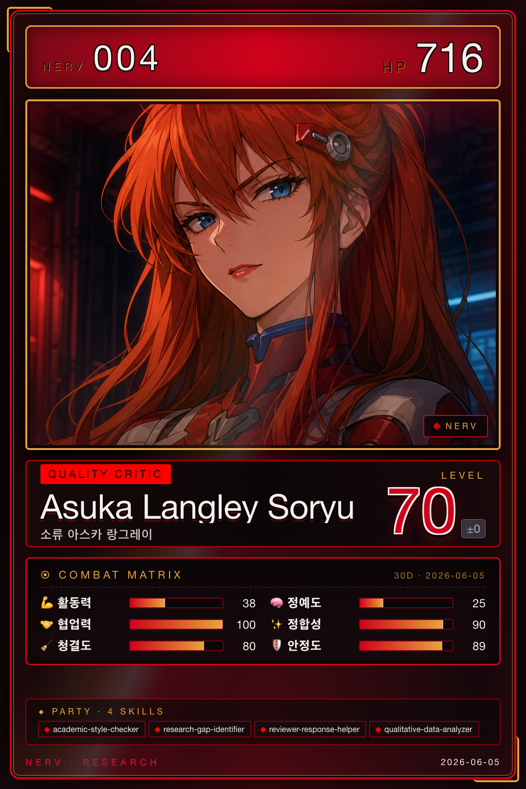

# 아스카 · Quality & Review

{ .avatar }
{ .card }

| 항목 | 값 |
|---|---|
| 캐릭터 | 아스카 (에반게리온 소류 아스카 랑그레이) |
| 역할 | Quality & Review |
| Discord Webhook | `asuka` |
| 소유 에이전트 | 4개 |

## 역할 개요

아스카는 NERV에서 **품질 및 검토(Quality & Review)**를 담당한다. 다른 역할이 생산한 원고와 분석 결과가 학술적 기준에 부합하는지 검수하고, 부족한 부분을 짚어 보완 방향을 제시하는 역할이다. 학술 문체의 일관성을 점검하고, 연구의 빈틈(갭)을 찾아내며, 심사 대응과 재투고를 지원하고, 질적 데이터의 주제 분석을 수행한다. 한마디로 결과물을 한 단계 더 엄격하게 다듬는 검증 게이트 역할을 맡는다.

## 소유 에이전트

- [academic-style-checker](../04-agents/asuka/academic-style-checker.md) — 학술 문체와 표현의 일관성을 검토
- [research-gap-identifier](../04-agents/asuka/research-gap-identifier.md) — 연구의 공백을 식별하고 기회를 도출
- [reviewer-response-helper](../04-agents/asuka/reviewer-response-helper.md) — 심사 의견 대응 및 재투고(R&R) 파이프라인 지원
- [qualitative-data-analyzer](../04-agents/asuka/qualitative-data-analyzer.md) — 질적 데이터의 주제 분석 수행

## 핸드오프

아스카는 주로 **수신 측** 역할로, 마리(글쓰기)·레이(분석)·카오루(탐색)가 넘긴 산출물을 받아 품질을 검토한다. 마리의 `writing_assistance_output`(원고 품질 검토), 레이의 `analysis_review_output`(분석 피드백 체인), 카오루의 `literature_discovery_output`(문헌 갭 분석 입력)을 입력으로 처리한다. 각 핸드오프 유형의 필수 필드와 라우팅 규칙은 [Handoff Schema](../06-systems/handoff.md)를 참조한다.
