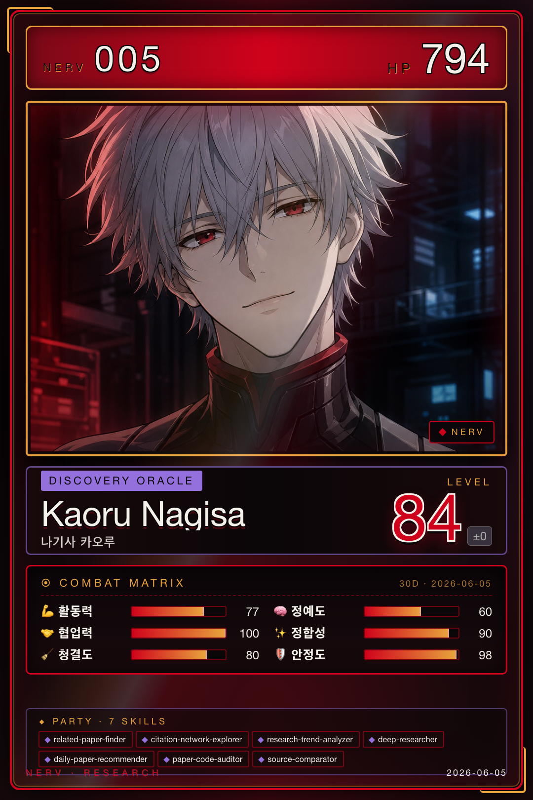

# 카오루 · Discovery & Insight

{ .avatar }
{ .card }

| 항목 | 값 |
|---|---|
| 캐릭터 | 카오루 (에반게리온 나기사 카오루) |
| 역할 | Discovery & Insight |
| Discord Webhook | `kaoru` |
| 소유 에이전트 | 9개 |

## 역할 개요
카오루는 NERV에서 **발견과 통찰(Discovery & Insight)**을 담당한다. 외부 학술 문헌을 탐색하고, 인용 네트워크와 연구 동향을 분석해 연구의 지형을 그려낸다. 단순 검색을 넘어 관련성 스코어링·다중 소스 비교·심층 자료 탐색으로 의미 있는 후보를 추려내고, 매일 프로젝트별 논문을 자동 큐레이션해 새로운 자극을 제공한다. 나아가 학술 원고의 인용 정합성과 통계 수치를 교차 검증하는 감사 기능까지 수행해, 발견한 지식이 다른 역할로 안전하게 흘러가도록 품질을 보증한다.

## 소유 에이전트
- [related-paper-finder](../04-agents/kaoru/related-paper-finder.md) — 키워드/DOI 기반 관련 논문 검색 및 관련성 스코어링
- [citation-network-explorer](../04-agents/kaoru/citation-network-explorer.md) — 인용 네트워크 분석 및 자연어 보고서 종합
- [research-trend-analyzer](../04-agents/kaoru/research-trend-analyzer.md) — 다년도 연구 동향 분석
- [deep-researcher](../04-agents/kaoru/deep-researcher.md) — 심층 자료 탐색 (탐색·종합·커버리지 지능 레이어 조합)
- [daily-paper-recommender](../04-agents/kaoru/daily-paper-recommender.md) — 매일 프로젝트별 논문 1편 자동 큐레이션
- [paper-code-auditor](../04-agents/kaoru/paper-code-auditor.md) — 논문-코드 정합성 감사 + 재현성 스코어링
- [source-comparator](../04-agents/kaoru/source-comparator.md) — 다중 소스 비교 매트릭스 + 합의/불일치 분석
- [paper-citation-auditor](../04-agents/kaoru/paper-citation-auditor.md) — 학술 원고 인용 정합성 감사 (APA 7판 파싱 + 본문 매칭)
- [paper-data-verifier](../04-agents/kaoru/paper-data-verifier.md) — 학술 원고 통계 수치 정합성 교차 검증

## 핸드오프
카오루는 탐색 산출물을 `literature_discovery_output` 핸드오프 유형으로 레이(지식 축적), 마리(원고 인용 소스), 아스카(갭 분석 입력), 신지(강의 자료 활용)에게 전달한다. 또한 발견 하위 계약인 `citation_network_output`·`research_trend_output`으로 인용 네트워크·연구 동향 산출을 관련 역할에 공유한다. 입력으로는 리츠코(탐색 과제 할당), 레이(기존 지식 참조), 미사토(신규 처리 문서)로부터 받는다. 자세한 내용은 [Handoff Schema](../06-systems/handoff.md)를 참조하라.
