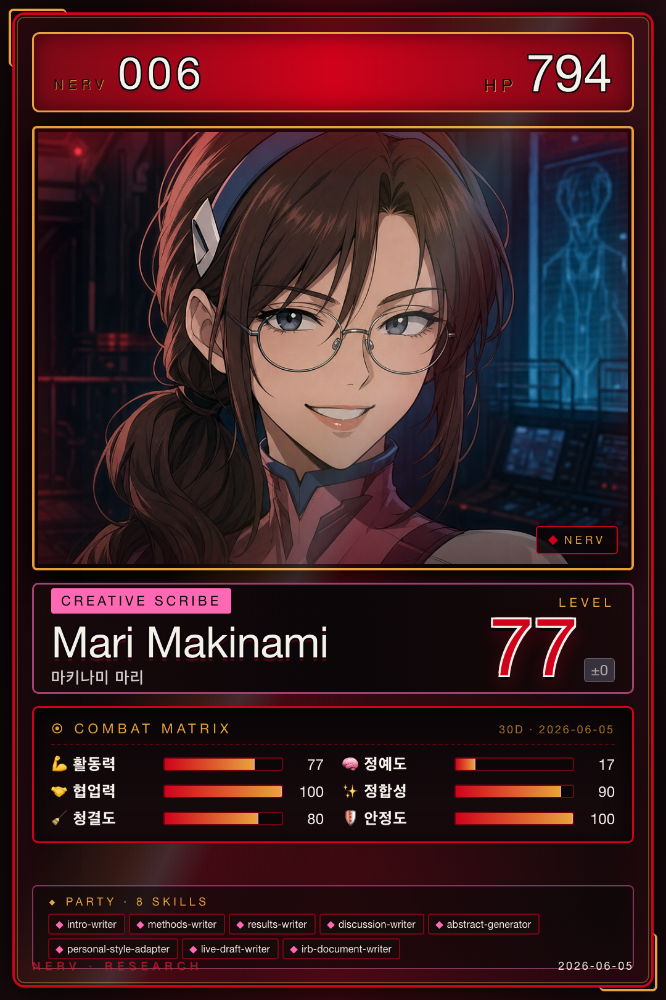

# 마리 · Creative & Writing

{ .avatar }
{ .card }

| 항목 | 값 |
|---|---|
| 캐릭터 | 마리 (에반게리온 마키나미 마리) |
| 역할 | Creative & Writing |
| Discord Webhook | `mari` |
| 소유 에이전트 | 6개 (+ 스킬 1) |

## 역할 개요

마리는 NERV에서 **Creative & Writing**(창작 및 집필)을 담당한다. 논문 원고의 각 섹션 — 서론, 방법, 결과, 논의, 초록 — 을 작성하고, IRB 신청서와 같은 연구 윤리 문서의 초안을 만든다. 분석·발견 단계에서 넘어온 자료를 학술 문체의 글로 변환하는 것이 핵심 기능이며, 작성한 원고는 품질 검토와 투고 준비 단계로 넘긴다. 학회지 서식에 맞춘 자동 편집 스킬도 함께 운용한다.

## 소유 에이전트

- [intro-writer](../04-agents/mari/intro-writer.md) — 서론 및 문헌 리뷰 작성
- [methods-writer](../04-agents/mari/methods-writer.md) — Methods(방법) 섹션 작성
- [results-writer](../04-agents/mari/results-writer.md) — Results(결과) 섹션 작성
- [discussion-writer](../04-agents/mari/discussion-writer.md) — Discussion(논의) 섹션 작성
- [abstract-generator](../04-agents/mari/abstract-generator.md) — 초록 및 결론 생성
- [irb-document-writer](../04-agents/mari/irb-document-writer.md) — IRB 신청서·동의서 작성
- **kaeim-formatter** *(스킬 · 에이전트 카운트 별도)* — 학회지 HWPX 서식 자동 편집

## 핸드오프

마리는 작성한 원고를 `writing_assistance_output` 핸드오프 유형으로 **아스카**(품질 검토용)와 **리츠코**(투고 준비용)에게 넘긴다. 이 핸드오프는 MAGI 교차 검증의 최고 등급(L3) 대상이다. 자세한 데이터 교환 규칙은 [Handoff Schema](../06-systems/handoff.md)를 참고한다.
