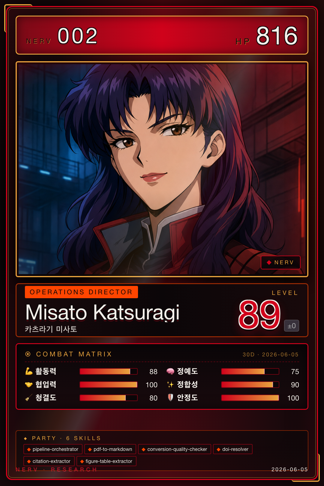

# 미사토 · Operations

{ .avatar }
{ .card }

| 항목 | 값 |
|---|---|
| 캐릭터 | 미사토 (에반게리온 카츠라기 미사토) |
| 역할 | Operations |
| Discord Webhook | `misato` |
| 소유 에이전트 | 6개 |

## 역할 개요
미사토는 NERV의 운영(Operations)을 담당하며, 외부 문서를 시스템이 다룰 수 있는 형태로 변환하는 문서 처리 파이프라인을 책임진다. PDF 원문을 Markdown으로 변환하고, 변환 품질을 검토하며, DOI 메타데이터 조회와 인용·그림·표 추출까지 일련의 전처리 과정을 조율한다. 다른 역할이 분석·탐색·작성에 집중할 수 있도록, 깨끗하고 구조화된 입력 자료를 만들어 공급하는 것이 미사토의 핵심 기능이다. 이 역할의 산출물은 분석·지식(레이)과 탐색(카오루) 역할의 출발점이 된다.

## 소유 에이전트
미사토의 소유 에이전트는 모두 Python 파이프라인으로 구현되어 있다. 자세한 내용은 [Python 파이프라인](../05-pipelines.md) 문서를 참고한다.

- [pipeline-orchestrator](../05-pipelines.md) — 문서 처리 파이프라인 전체를 조율
- [pdf-to-markdown](../05-pipelines.md) — PDF 원문을 Markdown으로 변환
- [conversion-quality-checker](../05-pipelines.md) — 변환 품질 검토 및 자동 보정
- [doi-resolver](../05-pipelines.md) — DOI 메타데이터 조회 (내부 폴백 단계 포함)
- [citation-extractor](../05-pipelines.md) — 본문 인용 정보 추출
- [figure-table-extractor](../05-pipelines.md) — 그림·표 추출 및 본문 링크 정합성 보정·캡션 매칭

## 핸드오프
미사토는 문서 처리 결과를 `document_processing_output` 핸드오프 유형으로 분석·지식 역할(레이)과 탐색 역할(카오루)에 전달한다. 자세한 데이터 교환 규약은 [Handoff Schema](../06-systems/handoff.md)를 참고한다.
