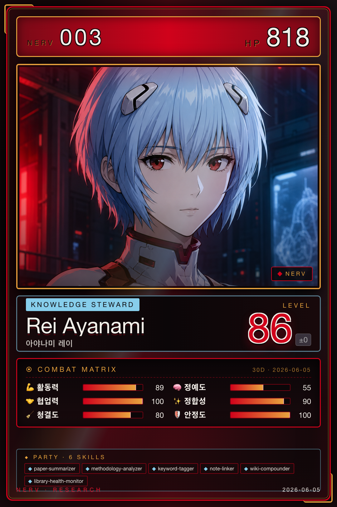

# 레이 · Analysis & Knowledge

{ .avatar }
{ .card }

| 항목 | 값 |
|---|---|
| 캐릭터 | 레이 (에반게리온 아야나미 레이) |
| 역할 | Analysis & Knowledge |
| Discord Webhook | `rei` |
| 소유 에이전트 | 7개 |

## 역할 개요

레이는 NERV의 **분석·지식 관리(Analysis & Knowledge)** 역할을 맡는다. 미사토(Operations)가 변환한 문서와 카오루(Discovery)가 발굴한 논문을 받아 요약·방법론 분석·키워드 표준화를 수행하고, 그 결과를 지식 베이스(노트·위키)에 축적한다. 단발성 분석에 그치지 않고, 새 논문이 들어올 때마다 기존 위키를 역방향으로 갱신해 지식이 복리로 쌓이도록 설계되어 있다.

또한 레이는 시스템 전체의 **지식 발행자(publisher)** 역할을 한다. 정리된 태그·링크·요약은 다른 역할이 구독해 활용하며, Library 정합성을 상시 감시해 지식 베이스의 건강도를 유지한다.

## 소유 에이전트

- [paper-summarizer](../04-agents/rei/paper-summarizer.md) — 다중 길이/관점별 논문 요약
- [methodology-analyzer](../04-agents/rei/methodology-analyzer.md) — 연구 설계 및 재현성 분석
- [keyword-tagger](../04-agents/rei/keyword-tagger.md) — 키워드 추출 및 태그 표준화
- [note-linker](../04-agents/rei/note-linker.md) — 노트 간 자동 백링크 생성 및 고아 노트 탐지
- [wiki-compounder](../04-agents/rei/wiki-compounder.md) — 위키 역방향 갱신을 통한 지식 복리 축적
- [library-health-monitor](../04-agents/rei/library-health-monitor.md) — Library 정합성 감시 및 건강도 리포트
- [reading-explainer](../04-agents/rei/reading-explainer.md) — 단일 논문 통독 후 Reading Brief 작성 (왜 읽는가 + 프로젝트 기여 매핑)

## 핸드오프

레이는 분석 결과를 `analysis_review_output` 핸드오프로 마리(Creative & Writing)에게 넘겨 글쓰기 단계로 연결한다. 또한 정리된 태그·링크·요약은 `knowledge_management_output` 핸드오프를 통해 발행-구독 모델로 모든 역할에 공유된다. 자세한 데이터 교환 규칙은 [Handoff Schema](../06-systems/handoff.md)를 참고하라.
