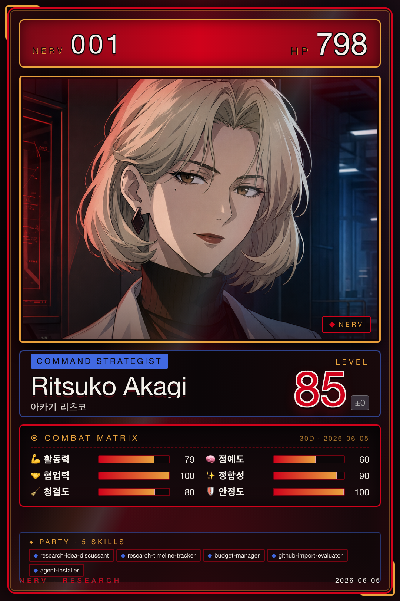

# 리츠코 · Project Command

{ .avatar }
{ .card }

| 항목 | 값 |
|---|---|
| 캐릭터 | 리츠코 (에반게리온 아카기 리츠코) |
| 역할 | Project Command |
| Discord Webhook | `ritsuko` |
| 소유 에이전트 | 6개 (5 Claude + 1 Python) |

## 역할 개요

리츠코는 NERV의 **Project Command**를 담당한다. 연구 프로젝트의 기획과 운영 전반을 총괄하는 사령탑 역할로, 연구 아이디어를 함께 다듬고, 프로젝트 일정을 추적하며, 연구비 예산을 관리한다. 또한 외부 도구·에이전트를 NERV에 도입할지 평가하고 설치하는 게이트키퍼 기능을 맡아, 시스템이 검증된 자원만 받아들이도록 관리한다. 다른 역할과의 핸드오프를 받아 연구 계획을 수립하고 각 역할로 작업을 분배하는 조율 지점이기도 하다.

## 소유 에이전트

- [research-idea-discussant](../04-agents/ritsuko/research-idea-discussant.md) — 소크라틱 방식으로 연구 아이디어를 함께 토론하고 다듬는 파트너
- [research-timeline-tracker](../04-agents/ritsuko/research-timeline-tracker.md) — YAML 기반으로 프로젝트 일정과 마일스톤을 추적·관리
- [budget-manager](../04-agents/ritsuko/budget-manager.md) — 연구비 예산 관리 및 집행 현황 점검
- [github-import-evaluator](../04-agents/ritsuko/github-import-evaluator.md) — 외부 GitHub 저장소의 도입 적합성 평가
- [agent-installer](../04-agents/ritsuko/agent-installer.md) — 검증된 외부 서브에이전트 자동 설치 및 메타데이터 갱신
- github-hunter — 외부 저장소를 주기적으로 탐색·평가하는 [Python 파이프라인](../05-pipelines.md) (7단계 오케스트레이터)

## 핸드오프

리츠코는 **research_planning_output** 핸드오프 유형으로 연구 계획을 카오루·미사토·마리·레이·신지에게 분배하며, 마리로부터 **publishing_revision_output**(역방향 핸드오프)을 받아 출판 단계의 수정 작업을 조율한다. 핸드오프 필드 정의와 검증 규칙은 [Handoff Schema](../06-systems/handoff.md)를 참조한다.
