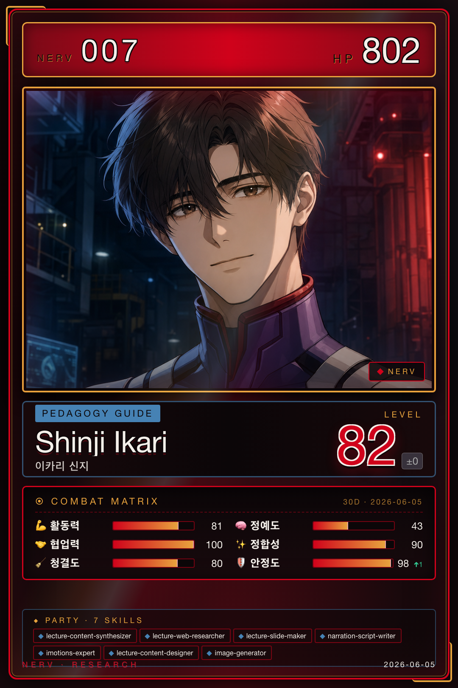

# 신지 · Personal & Learning

!!! warning "강의 도메인 종료 (2026-06-21)"
    NERV는 2026-06-21부로 **강의 콘텐츠 제작 도메인**을 더 이상 운영하지 않는다. 신지의 강의 계열 에이전트(`lecture-content-synthesizer`, `lecture-web-researcher`, `lecture-slide-maker`, `narration-script-writer`, `lecture-content-designer`)는 정의가 보존된 채 비활성 상태로 전환됐다. 단, `imotions-expert`(연구용 생체신호·시선추적 지식)와 `image-generator`(포토카드·웹툰·카드뉴스 공용)는 강의 전용이 아니므로 계속 운영된다.

{ .avatar }
{ .card }

| 항목 | 값 |
|---|---|
| 캐릭터 | 신지 (에반게리온 이카리 신지) |
| 역할 | Personal & Learning |
| Discord Webhook | `shinji` |
| 소유 에이전트 | 7개 |

## 역할 개요

신지는 NERV에서 **개인 학습과 강의 콘텐츠 제작(Personal & Learning)** 영역을 맡는다. 학술 자료를 강의용 내러티브로 풀어내고, 주제 조사·슬라이드·나레이션 대본·이미지를 거쳐 하나의 강의 콘텐츠로 완성하는 파이프라인을 담당한다. 강의 제작 외에도 생체 신호·시선 추적 등 연구용 센서 분석 도구에 대한 전문 지식을 조회·제공하는 역할을 함께 수행한다. 즉 "복잡한 연구 내용을 배우기 쉬운 형태로 바꾸는" 변환 계층이 신지의 정체성이다.

## 소유 에이전트

- [lecture-content-synthesizer](../04-agents/shinji/lecture-content-synthesizer.md) — 학술 자료를 강의용 내러티브로 변환
- [lecture-web-researcher](../04-agents/shinji/lecture-web-researcher.md) — 강의 주제 관련 웹 자료 검색
- [lecture-slide-maker](../04-agents/shinji/lecture-slide-maker.md) — HTML 강의 슬라이드 덱 생성 (carbon/ios/material 템플릿)
- [narration-script-writer](../04-agents/shinji/narration-script-writer.md) — 구술체 나레이션 대본 작성
- [imotions-expert](../04-agents/shinji/imotions-expert.md) — 생체 신호/시선 추적 센서·지표·연구설계 전문가 조회
- [lecture-content-designer](../04-agents/shinji/lecture-content-designer.md) — 강의 콘텐츠 설계 오케스트레이터
- [image-generator](../04-agents/shinji/image-generator.md) — 강의·콘텐츠용 이미지 생성

## 핸드오프

신지는 `expert_system_output` 핸드오프 유형으로 산출물을 내보내며, 전문가 지식과 강의 자료를 마리(원고 작성 활용)·레이(지식 축적)·리츠코(연구 기획 반영)에게 전달한다. 입력으로는 리츠코의 연구 기획, 카오루의 문헌 탐색, 레이의 지식 관리 산출을 수신한다. 자세한 교환 규칙은 [Handoff Schema](../06-systems/handoff.md)를 참고하라.
