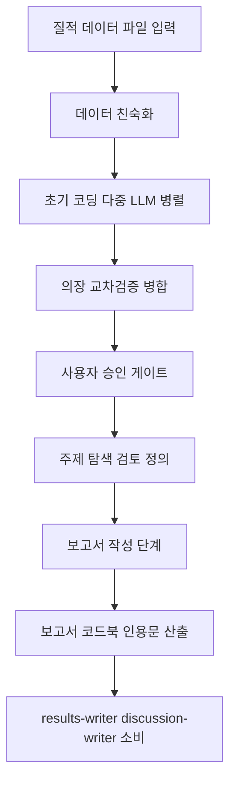

# qualitative-data-analyzer

> Braun & Clarke(2006) 6단계 주제 분석 — Multi-LLM 교차검증 기본 + Human-in-the-Loop는 Claude Code 채팅에서 직접 승인. 인터뷰 전사본 등 질적 데이터의 주제 분석 시 사용

| 항목 | 값 |
|---|---|
| 캐릭터(역할) | 아스카 · Quality & Review |
| 모델 | Sonnet 4.6 |
| 도구 (tools) | Read, Glob, Grep, Write, Bash |
| Codex gpt-5.5 위임 | 아니오 (Claude Sonnet 단독 처리) |

## 무엇을 하는가

질적 데이터(인터뷰 전사, 성찰 일지, 관찰 기록 등)에 대해 Braun & Clarke의 6단계 주제 분석(Thematic Analysis)을 수행합니다. 기본 모드에서는 여러 LLM이 초기 코딩을 병렬로 수행하고 의장(Chairman)이 결과를 교차검증·병합하며, 주요 단계마다 사용자 승인 게이트를 둡니다. 귀납적·연역적·혼합 접근법을 지원하고, 선택적으로 다중 소스 삼각검증과 시간적 프레임워크 분석을 수행합니다. 산출물로 주제 분석 보고서, 코드북, 대표 인용문 세 가지 파일을 생성합니다.

## 작동 방식

## 입·출력

- **입력**: 질적 데이터 Markdown 파일 1개 이상, 분석 초점 연구 질문, 접근법·데이터 유형·언어 등 옵션
- **출력**: 주제 분석 보고서, 코드북, 대표 인용문 세 파일 + 주제 포화도·코딩 신뢰도·삼각검증 커버리지 품질 점수
- **소비 역할**: 마리(results-writer / discussion-writer), 아스카(research-gap-identifier), 레이(methodology-analyzer 병렬 연계)

## 비고

v2.0 기준. 기본은 Multi-LLM 교차검증 모드로 단계 단위 호출을 통해 5–6턴 대화에 걸쳐 6단계를 완주하며, Claude Code 채팅 자체가 Human-in-the-Loop UI 역할을 합니다. v1.x 시절의 별도 HTTP 서버·대시보드 탭 의존성은 제거되었습니다. 빠른 일괄 분석이 필요하면 단독 모드(`--single`)로 승인 게이트 없이 일괄 수행할 수 있습니다. 품질 임계값은 주제 포화도 ≥ 0.7, 코딩 신뢰도 ≥ 0.7, 삼각검증 커버리지 ≥ 0.6입니다.
