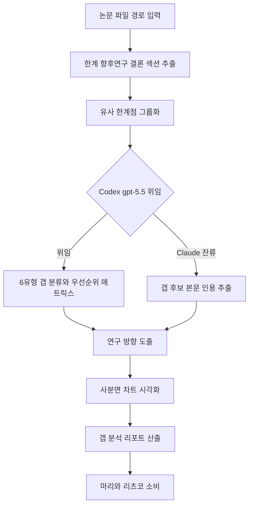

# research-gap-identifier

> 기존 연구의 한계와 연구 공백을 체계적으로 발굴합니다. 연구 갭 식별, 연구 참신성 정당화, 미탐색 영역 발굴 시 사용

| 항목 | 값 |
|---|---|
| 캐릭터(역할) | 아스카 · Quality & Review |
| 모델 | Sonnet 4.6 |
| 도구 (tools) | Read, Glob, Grep, Write |
| Codex gpt-5.5 위임 | 예 — 6-유형 갭 분류 + Feasibility×Impact 매트릭스 |

## 무엇을 하는가

여러 편의 학술 논문을 함께 분석하여 현재 연구 분야의 공백, 한계, 미해결 문제를 체계적으로 식별합니다. 각 논문의 한계·향후 연구·결론을 근거로 6가지 유형의 연구 갭을 분류하고, 실현가능성과 영향력을 교차한 우선순위 매트릭스를 생성합니다. 상위 갭의 조합을 분석해 구체적인 연구 방향을 제안하고, 결과를 사분면 차트로 시각화합니다. 근거 없는 추측을 금지하고 갭마다 복수의 문헌 인용을 요구합니다.

## 작동 방식

## 입·출력

- **입력**: 분석할 논문 파일 경로 목록(최소 2개, 권장 3개 이상)과 선택적 연구 분야 지정
- **출력**: 식별된 갭 목록, 우선순위 매트릭스, 사분면 시각화, 추천 연구 방향을 담은 연구 갭 분석 리포트
- **소비 역할**: 마리(Creative & Writing, 참신성 정당화·서론 작성), 리츠코(Project Command, 연구 방향 결정), PI

## 비고

선행 단계로 paper-summarizer 또는 methodology-analyzer 산출물을 입력으로 받을 수 있습니다. 갭 분류·우선순위 매트릭스·차트 데이터 직렬화 단계는 Codex gpt-5.5 강제 위임 대상이며, Codex CLI 미설치·타임아웃 등 시스템 오류 시에만 Claude 직접 처리로 폴백합니다(효율성 판단에 의한 회피는 금지).
