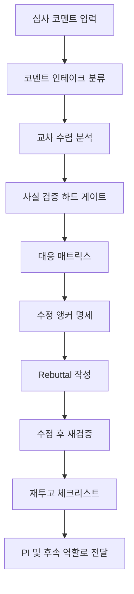

# reviewer-response-helper

> 심사위원 코멘트 수신부터 재투고까지 R&R(수정후재심/수정후게재) 전 과정을 지원합니다. 코멘트 구조화, 교차 수렴 분석, 코멘트-원고 사실 검증, 대응 매트릭스, 수정 앵커 명세, Rebuttal(심사의견 회신서) 작성, 수정 후 재검증, 재투고 체크리스트. 리뷰어 코멘트 응답, Rebuttal 작성, R&R 대응 전략 수립 시 사용

| 항목 | 값 |
|---|---|
| 캐릭터(역할) | 아스카 · Quality & Review |
| 모델 | Opus 4.8 |
| 도구 (tools) | Read, Glob, Grep, Bash, Write, Edit |
| Codex gpt-5.5 위임 | 아니오 (Claude Opus 단독 처리) |

## 무엇을 하는가

학술 논문 심사 코멘트를 받아 R&R(수정 후 재심·수정 후 게재) 대응의 전 과정을 지원하는 파이프라인 에이전트입니다. 코멘트 인테이크에서 시작해 복수 심사위원이 가리킨 공통 지적의 교차 수렴 분석, 코멘트와 원고 주장의 사실 검증, 대응 매트릭스와 수정 앵커 명세, 심사의견 회신서(Rebuttal) 작성, 수정 후 재검증, 재투고 체크리스트까지 8단계로 진행합니다. 사실 검증을 회신서 작성보다 먼저 수행하는 하드 게이트를 두어, 검증되지 않은 주장을 변호하지 않고 정정·공개하는 원칙을 따릅니다.

## 작동 방식

## 입·출력

- **입력**: 심사 코멘트 파일과 심사받은 원고, 리비전 라운드·언어·저널/학회명·마감일·논문 식별자 등 메타정보
- **출력**: 코멘트 구조화 문서, 수렴 분석과 대응 매트릭스가 담긴 수정 계획, 심사의견 회신서, 기계 판독용 수정 체크리스트, 재투고 체크리스트
- **소비 역할**: PI(연구 책임자)가 직접 트리거하며, 후속 정합성·수치 재검증과 문체 검토·서식 재변환은 카오루·마리·아스카 계열 에이전트와 연계

## 비고

v3.0(2026-06-10) 기준으로 인테이크·수렴·검증·매트릭스·앵커·회신서·재검증·재투고의 8단계 파이프라인으로 확장되었습니다. 핸드오프 스키마상 publish 경로에 해당해 MAGI Gate L3(Full Council) 등급으로 정의되며, 수정 과정에서 새로 추가된 인용·수치는 별도 재검증 단계를 거칩니다. 응답 전략은 사실 검증 선행, 판정 무게중심 배분, 증거 기반 차등화 등 실전에서 정형화한 원칙을 따릅니다.
