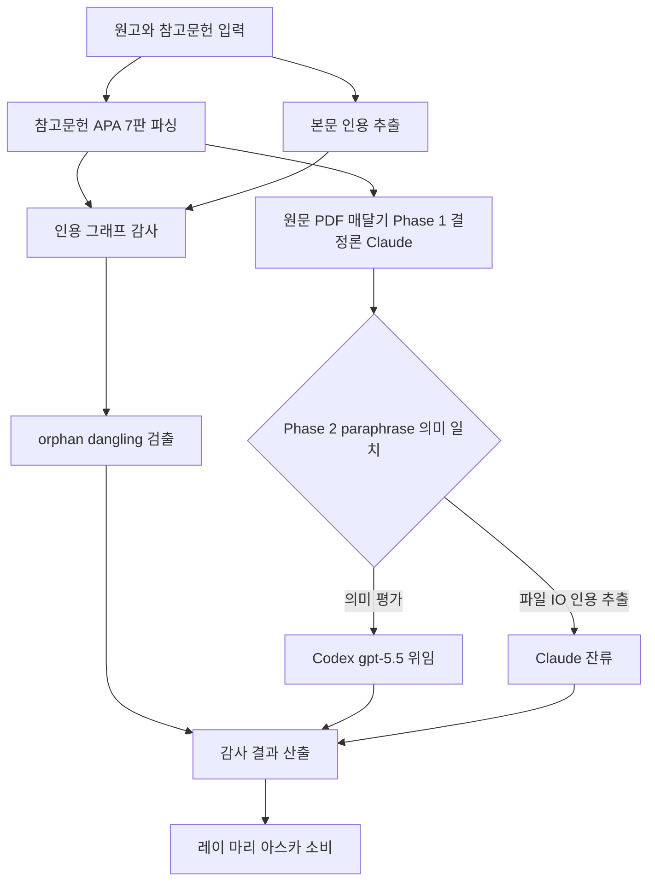

# paper-citation-auditor

> 학술 원고의 인용 정합성 감사 — references APA 7판 파싱 + 본문 in-text citation 매칭 + SourcePDF 매달기 + paraphrase 의미 일치 (Phase 2 Codex gpt-5.5 위임)

| 항목 | 값 |
|---|---|
| 캐릭터(역할) | 카오루 · Discovery & Insight |
| 모델 | Sonnet 4.6 |
| 도구 (tools) | Read, Glob, Grep, Bash, Write, WebSearch, WebFetch |
| Codex gpt-5.5 위임 | 예 — Phase 1 결정론(DOI 감사·PDF 매칭) + Phase 2 paraphrase 의미 일치는 Codex gpt-5.5 위임 |

## 무엇을 하는가

학술 원고와 참고문헌 목록을 입력받아 인용 정합성을 감사하는 에이전트다. 참고문헌을 APA 7판 형식으로 파싱하고, 본문의 in-text citation(괄호형·서술형·세미콜론 접두형 등)을 추출하여 양쪽을 대조한다. 참고문헌에는 있으나 본문에 인용되지 않은 항목(orphan)과, 본문에 인용되었으나 참고문헌에 없는 항목(dangling)을 검출한다. 나아가 원문 PDF를 매달아 인용 문장이 출처의 의미와 일치하는지(paraphrase) 검증한다.

## 작동 방식

## 입·출력

- **입력**: 학술 원고 파일과 APA 7판 참고문헌 목록 파일
- **출력**: 파싱된 참고문헌·본문 인용·매달린 원문 PDF·검증 결과(참고문헌 항목/본문 인용/paraphrase 일치 단위)를 담은 구조화 산출물
- **소비 역할**: 레이(분석·지식), 마리(작성), 아스카(품질·검토) 등 후속 역할 및 PI

## 비고

v1.0(2026-05-23) 신설. paper-data-verifier와 함께 카오루 소속 paper-verifier 인프라를 구성하며, paper-code-auditor의 cousin agent로 설계되었다. Phase 1(DOI 감사·PDF 매칭)은 결정론적 스크립트로 처리하고, Phase 2의 paraphrase 의미 일치만 Codex gpt-5.5에 위임한다. 본문 자동 정정은 수행하지 않으며(scope control), 임계값 미달을 부분 통과로 재프레이밍하지 않는 안티패턴 차단 규칙을 따른다.
