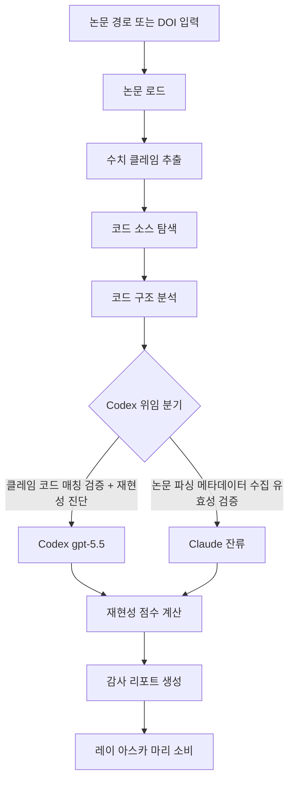

# paper-code-auditor

> 논문의 수치 클레임과 공개 코드/데이터셋을 교차 검증하여 재현 가능성을 평가합니다. 논문-코드 정합성 검사, 재현 가능성 평가 시 사용

| 항목 | 값 |
|---|---|
| 캐릭터(역할) | 카오루 · Discovery & Insight |
| 모델 | Sonnet 4.6 |
| 도구 (tools) | Read, Glob, Grep, WebSearch, WebFetch |
| Codex gpt-5.5 위임 | 예 — 논문 수치 클레임 ↔ 공개 코드 매칭 검증 |

## 무엇을 하는가

논문이 제시한 핵심 수치 클레임(정확도, F1, p값, 데이터셋 크기 등)을 추출하고, 공개된 코드 저장소·데이터셋과 실제로 일치하는지 교차 검증합니다. 코드 공개 여부, 의존성 명세, 난수 시드 고정, 환경 명세, 데이터 접근성, 클레임-코드 정합 등을 가중 체크리스트로 평가하여 재현성 점수를 0.0~1.0으로 산출합니다. 논문 메타데이터와 저장소 URL은 검색 결과로만 다루고 유효성을 직접 확인하여 할루시네이션을 방지합니다. 검증 불가한 값은 추측하지 않고 별도로 표기합니다.

## 작동 방식

## 입·출력

- **입력**: 논문 파일 경로 또는 DOI, 선택적으로 코드 저장소 URL과 감사 깊이 옵션
- **출력**: 재현성 점수와 항목별 평가, 핵심 클레임 검증 결과, 불일치 목록, 권고사항을 담은 감사 리포트(Markdown)
- **소비 역할**: 레이(Analysis & Knowledge), 아스카(Quality & Review), 마리(Creative & Writing) 등 후속 분석·리뷰 역할

## 비고

코드 평가 단계는 Codex gpt-5.5로 강제 위임되며, 논문 본문 파싱과 메타데이터 수집은 Claude가 수행합니다. Codex CLI 미설치·타임아웃 등 시스템 오류 시에만 Claude 직접 처리로 폴백합니다. 재현성 점수가 기준 미만이면 manual_review 플래그와 상위 검증 게이트를 트리거하도록 설계되어 있습니다.
