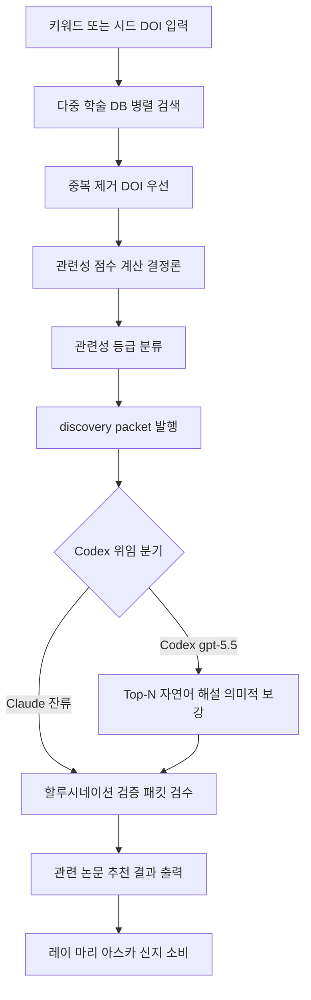

# related-paper-finder

> 키워드와 시드 DOI를 기반으로 관련 논문을 탐색하고 추천합니다. 관련 논문 검색, 문헌 목록 확장, 주제/DOI 기반 탐색 시 사용

| 항목 | 값 |
|---|---|
| 캐릭터(역할) | 카오루 · Discovery & Insight |
| 모델 | Sonnet 4.6 |
| 도구 (tools) | Read, Glob, Grep, Bash, WebSearch, WebFetch |
| Codex gpt-5.5 위임 | 예 — 다수 후보 관련성 스코어링 + Top-N 종합 (related-paper-finder·deep-researcher 공유 intelligence 레이어) |

## 무엇을 하는가

논문의 키워드, 시드 DOI, 인용 정보를 바탕으로 여러 학술 데이터베이스에서 관련 연구를 자동으로 탐색하고 추천한다. 다중 소스 검색·중복 제거·DOI 검증·관련성 점수 산출 같은 결정론적 단계는 Python 오케스트레이터로 처리하고, 본 에이전트는 결과를 받아 자연어 요약과 핸드오프 패킷 검수를 담당한다. 모든 논문 메타데이터는 검증된 API 응답에서만 가져오며, 존재하지 않는 논문이나 DOI를 생성하지 않는 할루시네이션 방지 규칙을 따른다.

## 작동 방식

## 입·출력

- **입력**: 검색 키워드 또는 시드 DOI(또는 논문 ID), 결과 수·연도 범위·최소 인용수 등 선택 필터
- **출력**: 관련성 등급별로 분류된 관련 논문 목록(JSON), 사람용 Markdown 리포트, 기계 판독용 discovery 핸드오프 패킷
- **소비 역할**: 레이(논문 분석·지식 축적), 마리(문헌 인용), 아스카(연구 갭 도출), 신지(강의 자료)

## 비고

v2.0(2026-05)에서 이전의 즉석 웹 검색 + LLM 관련성 스코어링 흐름을 Python 오케스트레이터 호출로 통합했다. 검색·DOI 검증·점수·패킷 생성은 결정론적 Python이 담당하고, LLM은 Top-N 자연어 해설과 상충 관점·한계·후속 질문의 의미적 채움만 수행한다. 자연어 종합 단계는 Codex gpt-5.5 강제 위임이며(deep-researcher와 공유 intelligence 레이어), Codex 비가용 시에만 본 에이전트가 직접 종합하는 fail-soft 구조다. 발견된 논문은 선택적으로 참고문헌 관리 도구에 자동 등록될 수 있다.
