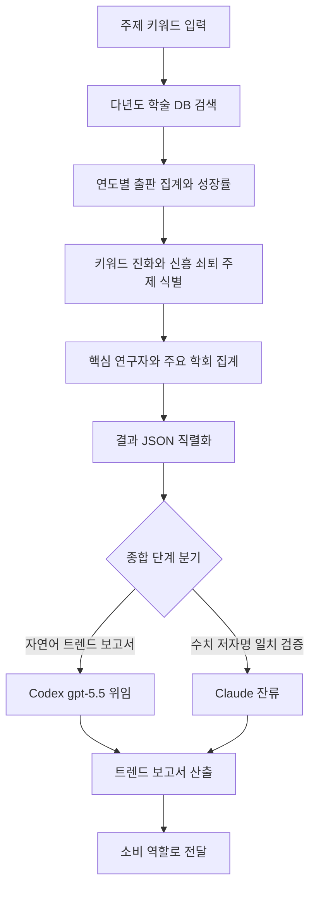

# research-trend-analyzer

> 연구 분야의 시간별 트렌드, 신흥 주제, 핵심 연구자를 분석합니다. 연구 동향 파악, 신흥 주제 발굴, 주요 연구자 매핑 시 사용

| 항목 | 값 |
|---|---|
| 캐릭터(역할) | 카오루 · Discovery & Insight |
| 모델 | Sonnet 4.6 |
| 도구 (tools) | Read, Glob, Grep, Bash, WebSearch, WebFetch |
| Codex gpt-5.5 위임 | 예 — 다년도 트렌드 자연어 보고서 종합 |

## 무엇을 하는가

특정 연구 분야의 시간에 따른 출판 동향, 신흥/쇠퇴 주제, 핵심 연구자와 주요 학술지를 분석합니다. 주제 키워드를 입력받아 다년도 학술 데이터베이스를 검색하고, 연도별 논문 수와 성장률, 키워드 진화, 상위 저자/학회를 집계합니다. 다년도 검색과 통계 집계는 결정론적 Python 파이프라인이 담당하고, 에이전트는 그 결과를 자연어 트렌드 해설로 풀어냅니다.

## 작동 방식

## 입·출력

- **입력**: 연구 주제/키워드, 분석 기간, 상위 N, 출력 형식 등 파라미터
- **출력**: 출판 동향·키워드 진화·신흥/쇠퇴 주제·핵심 연구자·주요 학회를 담은 구조화 JSON과 자연어 트렌드 보고서(Markdown)
- **소비 역할**: 레이(Analysis & Knowledge), 마리(Creative & Writing), 리츠코(Project Command)

## 비고

v2.0(Sprint A)에서 이전의 즉석 검색 + LLM 시계열 집계 흐름을 결정론적 Python 오케스트레이터 호출로 통합했습니다. 다년도 출판 집계·키워드 진화·신흥/쇠퇴 주제 식별·상위 저자/학회 산정은 Python이 결정론적으로 수행하고, 에이전트는 결과 JSON을 받아 트렌드 해설과 추천 읽을거리 제안만 담당합니다. 종합 단계는 Codex gpt-5.5로 강제 위임되며, 수치·저자명 일치 검증과 할루시네이션 방지는 Claude에 남습니다. 논문 메타데이터는 검증된 검색 결과에서만 가져오며 모델이 임의로 생성하지 않습니다.
