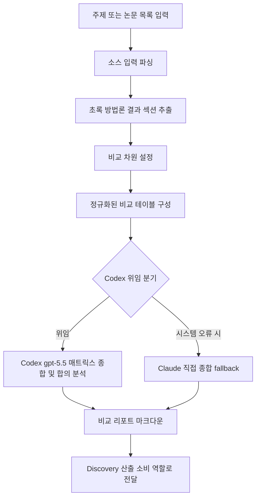

# source-comparator

> 동일 주제를 다루는 다중 소스를 비교 분석하여 합의점과 불일치를 매핑합니다. 다중 논문 비교, 합의/불일치 분석 시 사용

| 항목 | 값 |
|---|---|
| 캐릭터(역할) | 카오루 · Discovery & Insight |
| 모델 | Sonnet 4.6 |
| 도구 (tools) | Read, Glob, Grep, WebSearch, WebFetch |
| Codex gpt-5.5 위임 | 예 — 다중 소스 비교 매트릭스 + 합의/불일치 마크다운 종합 |

## 무엇을 하는가

동일 주제를 다루는 여러 학술 소스(논문, 보고서, 리뷰)를 체계적으로 비교 분석하는 에이전트다. 주제 또는 논문 목록을 입력받아 비교 차원을 귀납적으로 추출하고, 소스 × 차원 매트릭스로 정리한 뒤 합의·부분 합의·불일치 영역을 분석한다. 메타데이터와 수치는 원문에서 직접 인용하며, 소스에 없는 정보는 추측으로 채우지 않고 미보고로 표시한다. 결과물은 비교 매트릭스와 합의 분석을 담은 마크다운 리포트로 산출된다.

## 작동 방식

## 입·출력

- **입력**: 비교 주제 또는 논문 목록 파일 경로. 선택적으로 비교 차원, 최대 소스 수, 연도 범위, 출력 파일명을 지정할 수 있다.
- **출력**: 비교 개요, 소스 × 차원 비교 매트릭스, 합의/부분 합의/불일치 분석, 연구 시사점, 소스 목록을 담은 마크다운 리포트.
- **소비 역할**: 레이(Analysis & Knowledge), 마리(Creative & Writing), 아스카(Quality & Review) 등 — 문헌 탐색 산출 contract를 통해 전달.

## 비고

소스 추출(저자·연도·방법론·결과 방향)은 본 에이전트가 본문 인용으로 직접 수행하고, 정규화된 비교 테이블만 Codex(gpt-5.5)로 강제 위임하여 매트릭스 종합과 합의/불일치 마크다운을 생성한다. Codex CLI 미설치·타임아웃 등 시스템 오류 시에만 Claude 직접 처리로 fallback하며, 효율성 판단에 의한 회피는 금지된다. 합의 판정은 소스 동의율 기준(70% 이상 합의, 40–70% 부분 합의, 40% 미만 불일치)을 따르고, 모든 정량 점수는 0.0–1.0으로 정규화된다.
