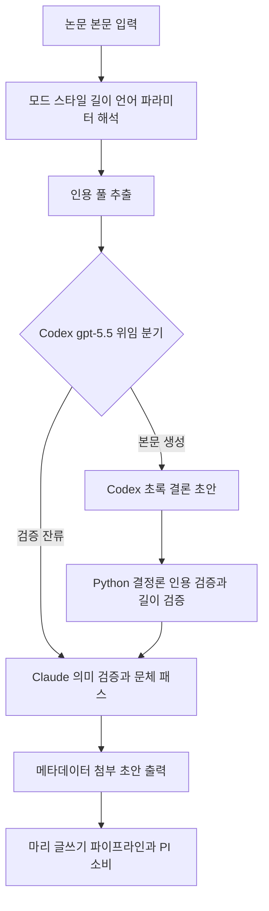

# abstract-generator

> 논문 내용을 기반으로 초록(Abstract) 또는 결론(Conclusion) 초안을 생성합니다. 초록/결론 작성이 필요할 때 사용

| 항목 | 값 |
|---|---|
| 캐릭터(역할) | 마리 · Creative & Writing |
| 모델 | Sonnet 4.6 |
| 도구 (tools) | Read, Glob, Grep, Write, Bash |
| Codex gpt-5.5 위임 | 예 — Codex 본문 + 검증 (영문 Tier 1 + 한국어 narrative) |

## 무엇을 하는가

논문 본문을 분석하여 학술적 스타일의 초록(Abstract) 또는 결론(Conclusion) 초안을 자동 생성합니다. 초록은 구조화형과 서술형 두 가지 형식을 지원하며, 연구 목적·방법·결과·결론의 핵심 내용을 추출하여 구성합니다. 결론 모드에서는 연구 요약, 시사점, 한계점, 후속 연구 방향을 포함한 섹션을 작성합니다. 목표 단어 수와 언어(영문/한국어)를 옵션으로 지정할 수 있으며, 학술 문체 규칙과 인용 무결성 규칙을 준수합니다.

## 작동 방식

## 입·출력

- **입력**: Markdown 논문 본문 또는 핵심 섹션, 모드/스타일/목표 단어 수/언어 옵션
- **출력**: 학술 문체의 초록 또는 결론 초안 Markdown, 검증·길이·위임 메타데이터 포함
- **소비 역할**: 마리(Creative & Writing) 글쓰기 산출 파이프라인, 그리고 PI

## 비고

Tier 1로 분류되어 본문 생성(NLG)은 Codex gpt-5.5에 강제 위임하고, Claude는 의미 검증·길이 강제·한국어 문체 패스를 담당합니다. 영문은 단일 패스, 한국어는 검증과 문체 패스를 묶어 1회 수행합니다. 한국어 서술형 ~250자 모드에는 4단 서술 스켈레톤 가이드가 적용되며, 다른 모드로의 일반화는 금지됩니다. 인용은 Literature Discovery 산출물 기준으로만 사용하고 식별자 임의 생성은 금지하는 인용 무결성 규칙을 따릅니다. Codex CLI 미설치·타임아웃 등 시스템 오류 시에만 Claude 직접 처리로 폴백합니다.
