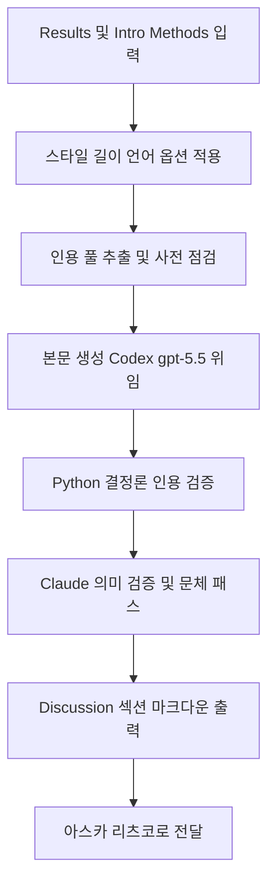

# discussion-writer

> 연구 결과를 해석하고 학술적 맥락에서 Discussion 섹션을 작성합니다. Discussion 섹션 초안 작성, 결과 해석, 선행연구 비교 시 사용

| 항목 | 값 |
|---|---|
| 캐릭터(역할) | 마리 · Creative & Writing |
| 모델 | Sonnet 4.6 |
| 도구 (tools) | Read, Glob, Grep, Write, Bash |
| Codex gpt-5.5 위임 | 예 — Tier 2 하이브리드 spec (영문 분기) |

## 무엇을 하는가

연구 결과를 해석하고, 선행연구와 비교하며, 시사점과 한계를 논의하는 Discussion 섹션을 작성합니다. Results, Introduction, Literature Review, Methods 섹션을 종합하여 결과 요약, 해석 및 선행연구 비교, 이론적·실용적 함의, 한계점, 후속 연구 방향을 체계적으로 구성합니다. Standard / Integrated / Implications-first 세 가지 작성 스타일과 길이·언어 옵션을 지원하며, 인용 무결성 규칙을 작성 중 실시간으로 준수합니다.

## 작동 방식

## 입·출력

- **입력**: Results 섹션 본문, 권장 입력으로 Introduction·Literature Review·Methods, 그리고 스타일·길이·언어 옵션
- **출력**: 결과 요약·해석·함의·한계·후속 연구를 갖춘 Discussion 섹션 초안 (Obsidian 호환 인용 키 포함)
- **소비 역할**: 아스카 (Quality & Review), 리츠코 (Project Command) 및 PI

## 비고

Tier 2 하이브리드 분류로 Codex(gpt-5.5)에 본문 생성을 위임하고 Claude로 의미 검증 + 문체 패스를 묶음 1회 수행합니다. 영문(`--lang en`) 분기가 Phase C-1에서 박혔고, 한국어(`--lang ko`) 분기는 별도 prompt body로 구성됩니다. 인용 무결성 프로토콜(DOI fabrication 금지, 인용-참고문헌 1:1 매칭 검증)이 필수이며, Codex CLI 미설치·타임아웃·인용 풀 부재 등 시스템 오류 시에만 Claude fallback을 허용합니다.
