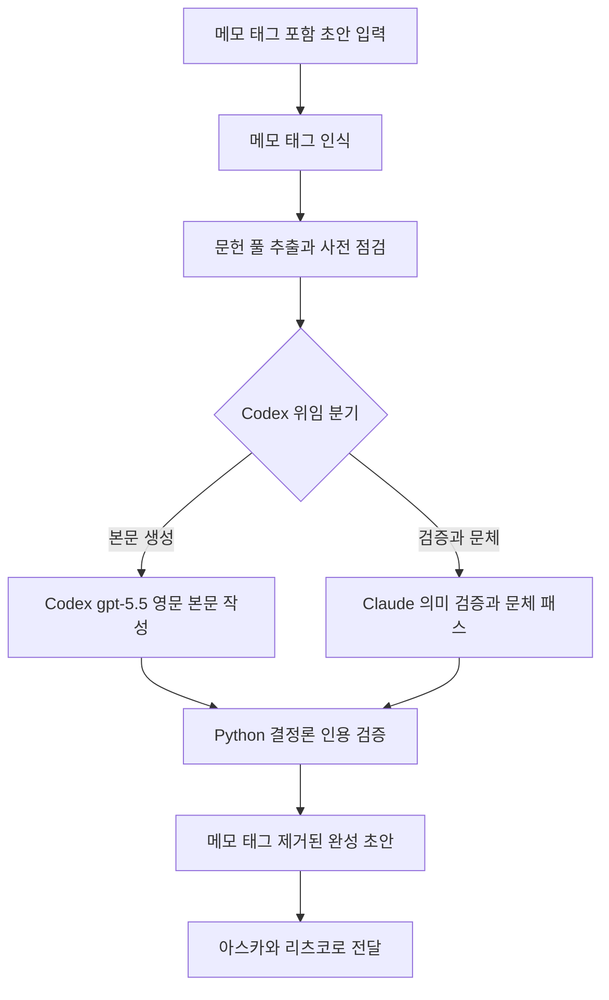

# intro-writer

> 학술 논문의 서론(Introduction) 및 이론적 배경/문헌 리뷰를 작성합니다. 서론, 이론적 배경, 문헌 리뷰 섹션 초안 작성 시 사용

| 항목 | 값 |
|---|---|
| 캐릭터(역할) | 마리 · Creative & Writing |
| 모델 | Sonnet 4.6 |
| 도구 (tools) | Read, Glob, Grep, Write, Edit, Bash |
| Codex gpt-5.5 위임 | 예 — Tier 2 하이브리드 spec (영문 분기) |

## 무엇을 하는가

학술 논문의 서론, 이론적 배경, 문헌 리뷰 섹션 초안을 작성하는 전문 에이전트다. 사용자가 작성한 뼈대 초안에 포함된 메모 태그를 인식해 자동으로 본문을 확장한다. 통합형(서론 내 이론적 배경 포함)과 분리형(서론과 이론적 배경 분리) 두 가지 구조를 지원하며, 메모 지시에 따라 분량과 문단 수를 조절한다. 인용 무결성 규칙을 준수해 검증되지 않은 식별자는 placeholder로 표기한다.

## 작동 방식

## 입·출력

- **입력**: 메모 태그가 포함된 스켈레톤 드래프트 마크다운 파일, 확장 강도와 언어 옵션
- **출력**: 모든 메모 태그를 처리해 제거한 완성된 서론·이론적 배경·문헌 리뷰 초안 (마크다운, frontmatter 보존, Obsidian 호환 인용 키)
- **소비 역할**: 아스카(Quality & Review), 리츠코(Project Command), 그리고 PI

## 비고

Tier 2 하이브리드로 분류되어 본문 생성은 Codex gpt-5.5에 위임하고, 의미 검증과 영문 문체 패스는 Claude가 묶어 1회 수행한다. 영문(`--lang en`) 분기가 우선 적용되며 한국어 분기도 별도 spec으로 존재한다. 인용 무결성 프로토콜을 필수 준수하여 식별자 fabrication을 금지하고, 검증되지 않은 인용은 마커로 표기한다. Codex 위임 실패는 시스템 오류 시에만 Claude fallback이 허용된다.
