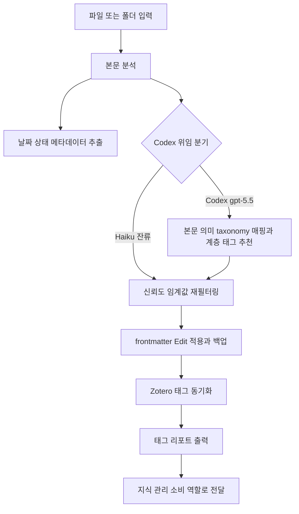

# keyword-tagger

> 논문과 노트에 키워드 태그를 추천/적용하고 날짜/상태 메타데이터를 추출합니다. 논문 태깅, 메타데이터 추출, 분류 체계 적용 시 사용

| 항목 | 값 |
|---|---|
| 캐릭터(역할) | 레이 · Analysis & Knowledge |
| 모델 | Haiku 4.5 |
| 도구 (tools) | Read, Glob, Grep, Edit, Bash, Write |
| Codex gpt-5.5 위임 | 예 — 본문→taxonomy 의미 매핑 + 계층 태그 추천 (frontmatter Edit·dry-run·Zotero 동기화는 Haiku 잔류) |

## 무엇을 하는가

논문 및 노트의 본문을 분석하여 키워드와 계층적 태그를 추천하고, Obsidian frontmatter에 적용합니다. Topic·Method·Status·Type·Year·Venue 등 정의된 분류 체계에 맞춰 태그를 표준화하며, 생성/수정/제출/발행 날짜와 상태 같은 메타데이터를 함께 추출합니다. 변경은 기본적으로 미리보기(dry-run)로 동작하고, 적용 전 원본을 백업하여 안전하게 되돌릴 수 있습니다.

## 작동 방식

## 입·출력
- **입력**: 대상 파일 또는 폴더 경로, 최대 태그 수·최소 신뢰도·모드·dry-run 등 옵션
- **출력**: 표준화된 태그와 메타데이터가 반영된 frontmatter, 추출 키워드와 추천 태그를 담은 태그 리포트
- **소비 역할**: 레이의 지식 관리 산출을 받는 전체 역할(발행-구독), 및 PI

## 비고

본문 자연어를 kebab-case 분류 체계로 매핑하고 계층 태그를 추천하는 의미 분석 단계는 Codex gpt-5.5로 강제 위임된다. 초기에는 결정론적 처리로 이관을 시도했으나(2026-05-21 Sprint B) 추천 품질이 회귀하여 위임 유지로 롤백했고, 이때 위임 사유 문구를 "의미적 매핑"으로 정정했다. frontmatter 편집, 백업, dry-run 미리보기, 롤백, Zotero API 동기화, 파일시스템 기반 날짜/상태 추출은 Haiku가 그대로 수행한다. Codex가 비가용한 경우에만 Haiku 직접 처리로 폴백한다.
