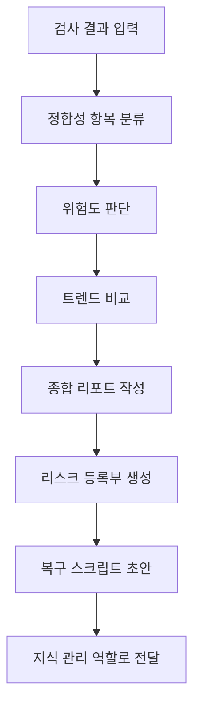

# library-health-monitor

> Library Health 검사 결과를 분석하고 위험한 복구 판단 + Markdown 리포트 작성. 논문 라이브러리 정합성 점검, 깨진 참조 탐지 시 사용

| 항목 | 값 |
|---|---|
| 캐릭터(역할) | 레이 · Analysis & Knowledge |
| 모델 | Haiku 4.5 |
| 도구 (tools) | Read, Glob, Grep, Write |
| Codex gpt-5.5 위임 | 아니오 (Claude Haiku 단독 처리) |

## 무엇을 하는가

논문 라이브러리의 정합성 검사 결과를 받아 의미적으로 해석하고, 사람이 읽을 수 있는 종합 건강 리포트를 작성하는 에이전트다. 중복 논문, 고아 노트, 유령 레코드, 상태값 위반, 깨진 참조 같은 정합성 문제를 위험도별로 판단하고, 각 항목에 대한 권고 액션과 복구 계획을 제시한다. 또한 최근 기록과 비교한 트렌드 분석으로 반복 패턴이나 증가 추세를 감지한다. 결정론적 검사·복구는 별도의 점검 루틴이 수행하며, 이 에이전트는 해석·리포트·알림 판단에 집중한다.

## 작동 방식

## 입·출력

- **입력**: 라이브러리 정합성 검사 결과 데이터와 최근 기간의 과거 리포트(트렌드 비교용)
- **출력**: 일간 종합 건강 리포트(Markdown), 기계 판독 가능한 리스크 등록부, 검토 후 실행하는 복구 스크립트 초안, 그리고 조건부로 고아 노트 통보 신호
- **소비 역할**: 레이(Analysis & Knowledge) 내부의 위키 보강 흐름, 그리고 PI(검토 및 복구 승인)

## 비고

진단에서 처방으로 격상된 v2.0 단계로, 위험도 기반 알림 판단과 구조화된 리스크 등록부 생성을 담당한다. 결정론적 검사·복구는 별도 점검 루틴이 처리하고 이 에이전트는 의미적 해석과 리포트만 맡는 역할 분담 구조가 이미 적용되어 있으며, 복구 스크립트는 항상 검토 후 실행을 전제로 제공된다.
