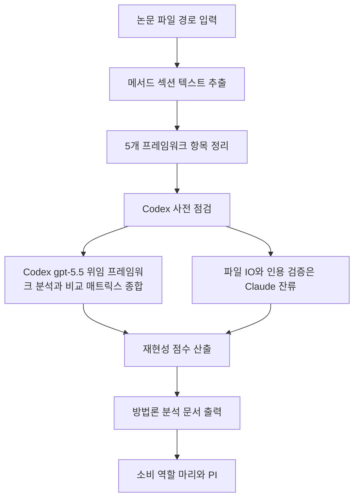

# methodology-analyzer

> 논문의 연구 방법론을 5개 프레임워크로 분석하고 재현성을 평가합니다. 방법론 분석, 재현성 평가, 연구 설계 비교 시 사용

| 항목 | 값 |
|---|---|
| 캐릭터(역할) | 레이 · Analysis & Knowledge |
| 모델 | Sonnet 4.6 |
| 도구 (tools) | Read, Glob, Grep, Bash, Write |
| Codex gpt-5.5 위임 | 예 — 5-프레임워크 분석 + 비교 매트릭스 종합 |

## 무엇을 하는가

논문의 연구 방법론을 5개 프레임워크(Research Design, Data & Materials, Model/Algorithm, Experimental Setup, Reproducibility)에 따라 체계적으로 분석합니다. 각 항목의 충족 여부를 근거로 재현성 점수를 산출하고, 강점·한계·재현 시 유의점을 정리합니다. 비교 모드에서는 여러 논문의 방법론을 한 매트릭스에 정렬해 핵심 차이점과 공통 접근법을 도출합니다. 분석 초점은 실험·이론·구현 중 하나로 좁힐 수 있습니다.

## 작동 방식

## 입·출력

- **입력**: Markdown 논문 파일 경로 1개 이상, 선택적 비교 모드 플래그와 분석 초점 옵션
- **출력**: 5개 프레임워크 분석과 재현성 점수를 담은 방법론 분석 문서. 비교 모드에서는 비교 매트릭스 문서
- **소비 역할**: 마리(Creative & Writing)의 글쓰기 단계, PI

## 비고

에이전트 버전 2.0. 5개 프레임워크 분석 결과 종합과 다중 논문 비교 매트릭스 작성 단계는 Codex gpt-5.5로 강제 위임되며, 파일 입출력·인용 검증·할루시네이션 방지는 본 에이전트가 그대로 수행합니다. Codex CLI 미설치·타임아웃·sandbox 거부 등 시스템 오류 시에만 Sonnet 직접 처리로 폴백합니다. 정보 미확인 항목은 추측 없이 "정보 없음"으로 명시하는 것이 품질 기준입니다.
