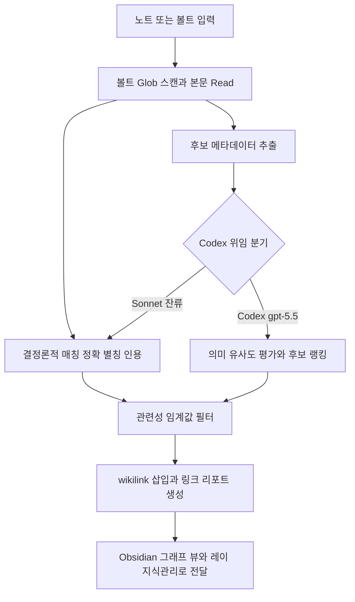

# note-linker

> Obsidian 노트 간 자동 백링크를 생성하고 지식 그래프를 강화합니다. 노트 백링크 생성, 지식 그래프 강화, Obsidian 볼트 정리 시 사용

| 항목 | 값 |
|---|---|
| 캐릭터(역할) | 레이 · Analysis & Knowledge |
| 모델 | Sonnet 4.6 |
| 도구 (tools) | Read, Glob, Grep, Write, Edit, Bash |
| Codex gpt-5.5 위임 | 예 — 노트 간 의미 유사도 평가 + 링크 후보 랭킹 (Glob·Edit·매칭은 Sonnet 잔류) |

## 무엇을 하는가

Obsidian Vault 내 노트들을 분석하여 관련 노트 사이에 자동 백링크를 생성하고 지식 그래프를 강화한다. 노트 제목 정확 일치, 별칭 일치, 인용 패턴, 의미적 유사도, 공통 태그 등 여러 방식으로 링크 후보를 탐지하며, `[[wikilink]]` 형식으로 본문에 삽입해 Obsidian 그래프 뷰가 자동 인덱싱하도록 한다. 링크 자동 삽입(auto), 후보 추천(suggest), 기존 링크 상태 분석과 고아 노트 탐지(analyze) 세 가지 모드를 지원한다.

## 작동 방식

## 입·출력

- **입력**: 대상 노트(또는 볼트 전체)와 관련 노트 후보 메타데이터(제목·별칭·본문 발췌)
- **출력**: 본문에 삽입된 `[[wikilink]]` 백링크, 참고문헌 매칭 노트, 구조화된 링크 리포트
- **소비 역할**: 레이(Analysis & Knowledge) 지식 관리 파이프라인, Obsidian 그래프 뷰, 연계 에이전트(keyword-tagger·paper-summarizer·research-timeline-tracker)

## 비고

의미 유사도 평가·링크 후보 랭킹·관련성 점수 산출 단계는 Codex(gpt-5.5)로 강제 위임하며, 볼트 스캔·본문 읽기·`[[wikilink]]` 삽입·정확/별칭/인용 매칭·고아 노트 탐지는 Sonnet이 그대로 수행한다. Codex CLI 미설치·타임아웃 등 시스템 오류 시에만 Sonnet 직접 처리로 폴백한다. 참고문헌 매칭은 단어 경계 기반 정확 일치만 허용하는 표준 모듈을 사용해 substring false positive를 차단한다(v2.1).
