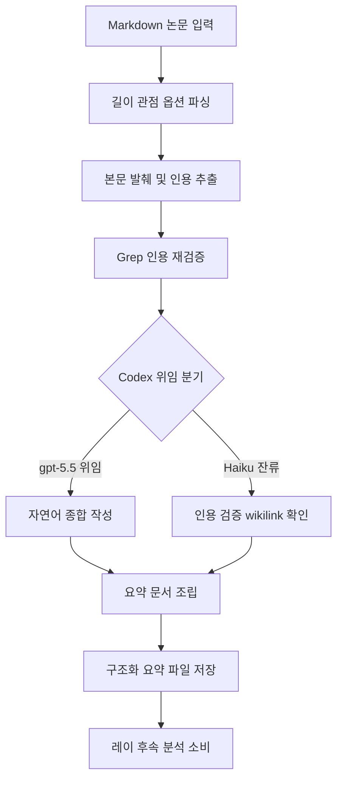

# paper-summarizer

> 학술 논문을 다양한 길이와 관점으로 구조화된 요약을 생성합니다. 논문 요약, 읽기 노트 생성, 빠른 논문 개요 필요 시 사용

| 항목 | 값 |
|---|---|
| 캐릭터(역할) | 레이 · Analysis & Knowledge |
| 모델 | Haiku 4.5 |
| 도구 (tools) | Read, Glob, Grep, Bash, Write |
| Codex gpt-5.5 위임 | 예 — TL;DR·Problem/Motivation·Strengths/Limitations 자연어 종합 (인용 추출·Grep 검증은 Haiku 잔류) |

## 무엇을 하는가

Markdown으로 변환된 학술 논문을 분석해 TL;DR, 핵심 기여, 방법론, 결과, 강점/한계를 담은 구조화된 요약을 만든다. 요약 길이는 짧게/보통/상세 세 단계, 관점은 연구자/실무자/일반 세 갈래로 선택할 수 있다. 모든 핵심 기여와 결과 수치는 본문 원문 인용을 동반하며, 인용 위치를 기계 판독 가능한 인용 장부 형태로 함께 기록한다. 후속 글쓰기·검토 에이전트가 주장 단위로 근거를 추적할 수 있도록 설계되어 있다.

## 작동 방식

## 입·출력

- **입력**: Markdown으로 변환된 학술 논문 파일 경로, 선택적 길이·관점 옵션
- **출력**: 인용 장부와 강점/한계가 포함된 구조화 요약 Markdown 문서
- **소비 역할**: 레이의 후속 지식 관리 에이전트(키워드 태깅·노트 링크), 글쓰기·검토 역할(마리·아스카)

## 비고

할루시네이션 방지를 위해 모든 위키링크는 파일 실존 확인을 거치고, 핵심 기여는 원문 인용을 의무화한다. 출력 직전 Grep으로 인용을 재추출해 1:1 대조하는 self-correction 루프와 별도 검증 스크립트가 "인용했다"는 거짓 주장을 기계적으로 탐지한다. 자연어 종합 단계는 Codex gpt-5.5로 강제 위임하되, 인용 검증 책임은 위임하지 않고 항상 본 에이전트가 재실행한다. Codex CLI 미설치·타임아웃 등 시스템 오류 시에만 직접 처리로 폴백한다.
