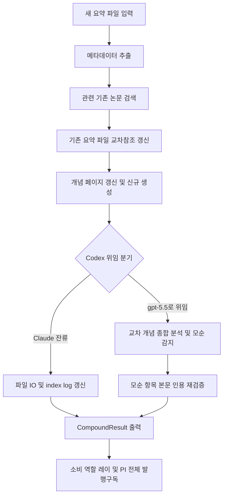

# wiki-compounder

> 새 논문 수집 후 기존 위키 페이지를 역방향 갱신하여 지식을 복리로 축적합니다. 논문 간 교차 참조, 개념 페이지 강화, 모순 감지, index/log 갱신을 수행합니다. 새 논문 수집 후 위키 갱신, 개념 페이지 복리 축적이 필요할 때 사용

| 항목 | 값 |
|---|---|
| 캐릭터(역할) | 레이 · Analysis & Knowledge |
| 모델 | Sonnet 4.6 |
| 도구 (tools) | Read, Glob, Grep, Write, Edit, Bash |
| Codex gpt-5.5 위임 | 예 — 3편 이상 교차 개념 종합 + 모순 감지 (index/log/concept 파일 I/O는 Sonnet 잔류) |

## 무엇을 하는가
새 논문 한 편이 요약·태깅된 뒤, 기존 지식 위키 전체를 역방향으로 갱신하여 지식을 복리로 축적하는 에이전트다. 한 건의 수집이 여러 개의 기존 페이지 업데이트로 이어지도록, 논문 간 교차 참조를 걸고 관련 개념 페이지를 강화한다. 새 논문이 기존 주장과 충돌하면 모순을 감지해 표시하고, 더 강한 근거로 기존 주장을 갱신하는 경우 명시적 근거 사슬로 기록한다. 카파시 LLM 위키의 Compounding 패턴 구현이다.

## 작동 방식

## 입·출력
- **입력**: 방금 생성된 새 논문 요약 파일 경로, 선택적 dry-run 플래그(수정 없이 계획만 출력)
- **출력**: 갱신된 위키 페이지 목록, 신규 생성된 개념 페이지, 발견된 모순 항목, 작업 로그 기록을 담은 CompoundResult 요약
- **소비 역할**: 레이(지식 관리) 및 발행-구독 모델을 통해 전체 역할·PI

## 비고
3편 이상 교차하는 개념의 종합 분석과 모순 감지 판정은 Codex gpt-5.5로 강제 위임되며, index/log/concept 파일 입출력은 Sonnet에 잔류한다. Codex가 반환한 모순 항목은 본문 인용으로 재검증한 뒤에만 기록되며, 인용 출처 검증은 위임하지 않는다. 한 번에 최대 20개 파일까지만 수정하고, 원시 소스는 절대 수정하지 않는다. 더 강한·최신 근거로 기존 주장을 갱신할 때는 수치 신뢰도 점수 대신 검증 가능한 근거 사슬(evidence-chain)로 기록하며, 이전 주장은 삭제하지 않고 링크로 보존한다.
