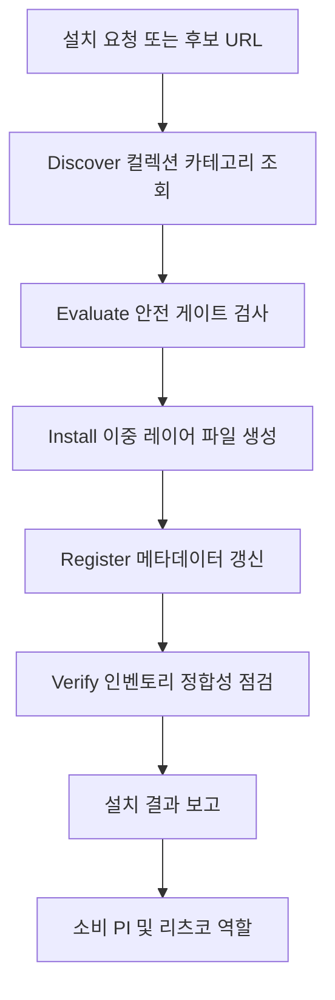

# agent-installer

> Install Claude Code subagents from any GitHub-hosted collection (default VoltAgent/awesome-claude-code-subagents) into NERV's two-layer structure. Trigger when the user asks to install/import an agent from a GitHub repo or a github-hunter shortlist URL.

| 항목 | 값 |
|---|---|
| 캐릭터(역할) | 리츠코 · Project Command |
| 모델 | Haiku 4.5 |
| 도구 (tools) | Bash, WebFetch, Read, Write, Glob |
| Codex gpt-5.5 위임 | 아니오 (Claude Haiku 단독 처리) |

## 무엇을 하는가

agent-installer는 GitHub에 공개된 서브에이전트 컬렉션에서 외부 에이전트를 가져와 NERV의 이중 레이어 구조에 맞춰 설치하는 plumbing 에이전트다. 원본 컬렉션은 평탄한 단일 파일 구조를 가정하지만, NERV에서는 서브에이전트 정의 파일과 캐릭터별 워크플로우 메타 파일 두 장을 동시에 만들어야 시스템이 새 에이전트를 인식한다. 설치 과정에서 라이선스 검증·보안 패턴 검사·모델 선언 검증·이름 충돌 확인 같은 안전 게이트를 거치며, 설치 후에는 관련 메타데이터 파일들을 함께 갱신해 인벤토리 정합성을 유지한다.

## 작동 방식

## 입·출력

- **입력**: 직접 지정한 GitHub 저장소·에이전트 이름, 또는 github-hunter shortlist에서 추출한 origin 파라미터와 대상 캐릭터(역할)
- **출력**: NERV 이중 레이어에 설치된 서브에이전트 정의 + 캐릭터 어댑터 메타 파일, 갱신된 인벤토리 메타데이터, 인벤토리 정합성 점검 결과 보고
- **소비 역할**: PI(설치 승인·결과 확인) 및 리츠코(Project Command, 본 에이전트 소유 역할). 설치된 신규 에이전트는 해당 캐릭터 역할에 편입

## 비고

리츠코의 GitHub Hunter 파이프라인 마지막 단계(Stage 7 plumbing)로 도입되었으며, 결정론적 설치 흐름은 Claude Haiku 단독으로 처리한다. 명시 승인 없는 설치를 금지하고, 위험 권한 패턴 검출 시 HARD GATE로 차단하는 보안 자세를 따른다. 설치 직후 변경 사항을 캡처해 롤백이 가능하도록 준비한다. 결정론 단계의 Python 이관은 실제 호출 이력이 쌓이기 전 speculative 작성을 피하기 위해 보류 상태이며, 그때까지 LLM(Haiku) flow를 유지한다.
