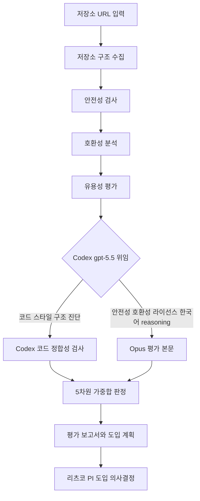

# github-import-evaluator

> GitHub 저장소(스킬/플러그인/에이전트/MCP 서버)를 분석하여 NERV 시스템 호환성·유용성·안전성을 평가하고 도입 계획을 수립합니다. GitHub 저장소 도입 검토, 외부 스킬/플러그인 평가 시 사용

| 항목 | 값 |
|---|---|
| 캐릭터(역할) | 리츠코 · Project Command |
| 모델 | Opus 4.8 |
| 도구 (tools) | Read, Glob, Grep, Write, Edit, Bash, WebFetch, WebSearch |
| Codex gpt-5.5 위임 | 예 — 저장소 코드 스타일/구조 정합성 진단 |

## 무엇을 하는가

GitHub에 공개된 Claude Code 스킬·플러그인·에이전트·MCP 서버를 5차원 루브릭(안전성·호환성·유용성·품질·도입노력)으로 평가하여 NERV 시스템에 도입할지 판정하는 전략 평가 에이전트입니다. 저장소 구조를 수집하고, 위험 명령·시크릿·난독화 신호를 스캔하는 안전성 검사를 수행하며, NERV 기존 에이전트와의 중복·충돌을 확인합니다. 가중합 점수에 따라 도입(adopt)·각색 후 도입(adapt)·보류(skip) 중 하나로 판정하고, 평가 보고서와 도입 계획을 산출합니다.

## 작동 방식

## 입·출력

- **입력**: 평가 대상 GitHub 저장소(스킬/플러그인/에이전트/MCP 서버)의 주소와 핵심 파일
- **출력**: 5차원 가중합 점수에 따른 판정(도입/각색/보류)과 평가 보고서·도입 계획, 평가 인덱스
- **소비 역할**: 리츠코(Project Command) 및 PI — 도입 여부 최종 의사결정. 도입 승인 시 후속 설치 단계로 연계

## 비고

안전성 검사에는 위험 키워드 매칭과 함께 보조 신호로 Entropy Check(난독화 탐지)를 사용한다. 단, 다국어 주석이 많은 정상 코드에서 오탐이 발생할 수 있어 점수 자동 차감 없이 사람 검토 권고만 남기는 low-confidence 신호로 다룬다. 코드 스타일·구조 정합성 진단 단계는 Codex gpt-5.5 강제 위임 대상이며, Codex CLI 미설치·타임아웃 등 시스템 오류 시에만 본 에이전트가 직접 처리하는 fallback이 허용된다. 호환성·안전성·라이선스 평가의 한국어 reasoning은 본 에이전트가 그대로 수행한다.
