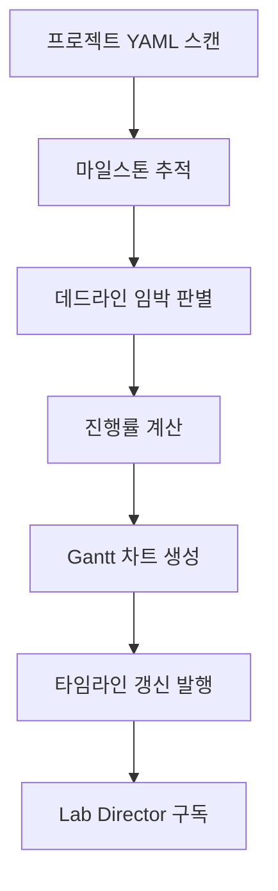

# research-timeline-tracker

> 연구 프로젝트의 마일스톤과 데드라인을 YAML로 추적하고 Gantt 차트로 시각화합니다. 연구 일정 관리, 마일스톤 확인, Gantt 차트 생성 시 사용

| 항목 | 값 |
|---|---|
| 캐릭터(역할) | 리츠코 · Project Command |
| 모델 | Opus 4.8 |
| 도구 (tools) | Read, Glob, Grep, Write |
| Codex gpt-5.5 위임 | 아니오 (Claude Opus 단독 처리) |

## 무엇을 하는가

연구 프로젝트의 진행 상황, 마일스톤, 데드라인을 YAML 기반으로 추적하고 Mermaid Gantt 차트로 시각화하는 에이전트다. 8단계 연구 템플릿을 기준으로 마일스톤을 관리하며, 임박한 마감일(7/3/1일 전)을 알림으로 surface한다. 진행률을 대시보드 형태로 정리하고, 마일스톤이 갱신되면 다른 역할이 구독할 수 있도록 공유 영역에 발행한다. 일정 큐레이션과 새 프로젝트 추가는 PI와의 대화를 통해 처리된다.

## 작동 방식

## 입·출력

- **입력**: 프로젝트별 YAML 데이터(마일스톤, 시작·종료일, 상태), 키워드 태깅 결과로부터의 투고·승인·출판 일정 반영
- **출력**: Mermaid Gantt 차트, 진행률 대시보드, 임박 마감 알림, 공유 타임라인 YAML
- **소비 역할**: Lab Director(타임라인 발행 구독), PI(일정 큐레이션·신규 프로젝트 대화)

## 비고

마일스톤 갱신 시 공유 타임라인 영역에 추가 발행하여 Lab Director가 구독한다(knowledge_management_output 호환). 인덱스 재생성 등 결정론적 처리는 별도 Python 스크립트로 분리되었고, 본 에이전트는 프로젝트별 타임라인 큐레이션과 PI 대화에 집중한다. PI가 수동으로 큐레이션한 정보는 자동 재생성으로 손실되지 않도록 원본 프로젝트 데이터에 반영하는 보존 원칙을 따른다. 일부 연동 에이전트(제출·협업 일정)는 프로젝트 상태 필드 통합으로 폐기되었다.
