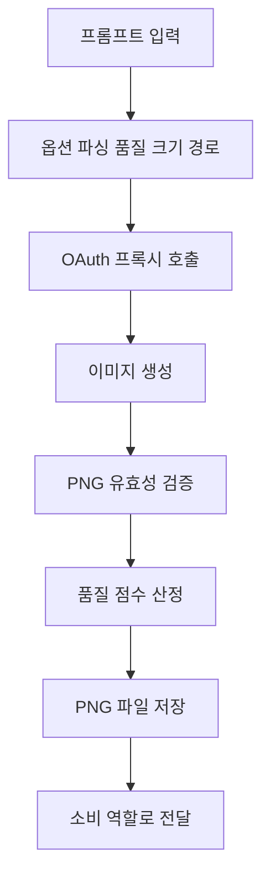

# image-generator

> 텍스트 프롬프트에서 PNG 이미지를 생성합니다. 포스터 히어로 이미지, 슬라이드 타이틀 카드, 카드뉴스 일러스트, 논문/강의용 컨셉 그림이 필요할 때 사용. ChatGPT Pro OAuth 프록시를 경유하므로 OpenAI API 과금 없이 구독 한도 내에서 동작

| 항목 | 값 |
|---|---|
| 캐릭터(역할) | 신지 · Personal & Learning |
| 모델 | Sonnet 4.6 |
| 도구 (tools) | Read, Write, Bash |
| Codex gpt-5.5 위임 | 아니오 (Claude Sonnet 단독 처리) |

## 무엇을 하는가

텍스트 프롬프트를 입력으로 받아 PNG 이미지를 생성하는 에이전트입니다. 포스터·슬라이드·카드뉴스의 히어로/배너/일러스트, 그리고 강의·논문용 컨셉도나 인포그래픽을 텍스트 설명만으로 만들 때 사용합니다. 생성 후 PNG 유효성과 최소 바이트, 요청한 크기를 검증해 품질 점수를 부여하며, 미달 시 호출자가 재시도하거나 품질을 상향하도록 신호합니다. 통계 그래프(Matplotlib/Plotly)나 벡터 다이어그램, 이미지 편집은 대상이 아닙니다.

## 작동 방식

## 입·출력

- **입력**: 이미지 설명 프롬프트(영어 권장, 한국어 가능)와 선택 옵션(품질 low/medium/high, 크기, 저장 경로).
- **출력**: 저장된 PNG 파일과 메타데이터(가로/세로, 바이트, 해시, 품질 점수, 검증 실패 시 사유).
- **소비 역할**: 신지 산하 슬라이드·강의 제작 에이전트, 카드뉴스/포스터 파이프라인 등 이미지 자원을 요청한 타 에이전트 및 PI.

## 비고

OpenAI API 직접 과금 대신 로컬 OAuth 프록시를 경유해 ChatGPT Pro 구독 한도 내에서 동작합니다. 품질 점수 0.8 이상이면 정상으로 간주합니다. 이미지 편집/인페인트는 현재 미지원으로 향후 버전에서 다룰 예정입니다. 원 레포지토리는 MIT 라이선스 기반입니다.
