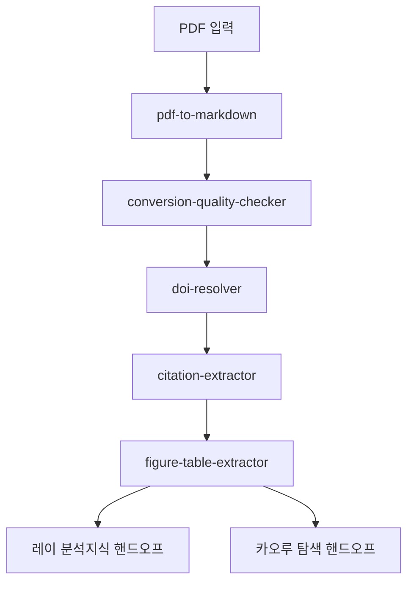

# Python 파이프라인 (7)

NERV에는 서브에이전트(LLM 기반)와 별개로, **`scripts/`에서 실행되는 결정론적 Python 파이프라인 7개**가
있습니다. 이들은 LLM 추론이 아니라 파일 변환·API 조회·정합성 검사·랭킹 같은 **재현 가능한 절차**를
담당합니다. 같은 입력에 대해 같은 출력을 보장하는 영역은 LLM 대신 코드로 처리한다는 원칙에 따른 구성입니다.

- **미사토 · Operations (6)** — 논문 PDF를 구조화된 Markdown으로 변환하는 문서처리 파이프라인.
- **리츠코 · Project Command (1)** — 외부 에이전트를 자율 탐색·평가하는 주간 GitHub Hunter.

> 캐릭터·역할 체계는 [3 · 캐릭터](03-characters/index.md), LLM 서브에이전트 38개는
> [4 · 서브에이전트](04-agents/index.md)를 참고하세요.

---

## 미사토 · Operations — 문서처리 파이프라인 (6)

PDF로 들어온 논문을 변환·검증·메타데이터 보강하여 분석 가능한 형태로 만든 뒤,
지식 관리(레이)와 탐색(카오루) 역할로 핸드오프하는 6단계 파이프라인입니다.

### 1. pipeline-orchestrator

- **기능** — 문서처리 6단계를 순차 실행하고 단계별 품질 게이트를 적용하는 오케스트레이터.
- **핵심 단계**
  1. 입력 PDF 큐 수집 및 처리 모드 결정(explore / produce / publish 3계층 정책).
  2. 하위 모듈(변환 → 품질검사 → DOI → 인용 → 도표) 순차 디스패치.
  3. 단계별 산출물 집계 및 다운스트림 핸드오프 페이로드 구성.

### 2. pdf-to-markdown

- **기능** — `marker-pdf` 기반으로 PDF를 구조 보존 Markdown으로 변환(GPU/MPS 가속, CPU 폴백).
- **핵심 단계**
  1. PDF 레이아웃 분석(헤딩·문단·표·수식 영역 탐지).
  2. 텍스트·구조 추출 후 Markdown 직렬화.
  3. frontmatter 정규화 및 산출 파일 기록.

### 3. conversion-quality-checker

- **기능** — 변환 결과의 품질 점수를 산출하고 임계값 게이트로 통과 여부를 판정.
- **핵심 단계**
  1. 텍스트 보존율·구조 정합성·노이즈 지표 측정.
  2. `conversion_quality` 점수(0.0~1.0) 산출.
  3. 임계값 **0.7** 미달 시 단계별 정책에 따라 경고·플래그·차단 처리.

### 4. doi-resolver

- **기능** — 논문 메타데이터를 다중 레지스트리에서 교차 조회하여 DOI를 확정.
- **핵심 단계**
  1. **CrossRef + DataCite + doi.org** 3-레지스트리 동시 조회.
  2. 국내 논문은 **KCI 폴백** 스테이지로 보완.
  3. `doi_confidence` 임계값 **0.8** 이상에서 매칭 확정, 미달 시 후보 플래그.

### 5. citation-extractor

- **기능** — 본문 말미의 참고문헌 목록을 구조화된 항목으로 추출.
- **핵심 단계**
  1. 참고문헌 섹션 경계 탐지.
  2. 개별 인용 항목 파싱(저자·연도·제목·출처 분해).
  3. 정규화된 인용 레코드 직렬화.

### 6. figure-table-extractor (v2.0)

- **기능** — 그림·표를 추출하고 본문 내 참조 링크와의 정합성을 보정.
- **핵심 단계**
  1. 도표 객체와 캡션 영역 탐지.
  2. 본문 참조 표현과 도표 번호의 **링크 정합성 검사 및 캡션 매칭**.
  3. 정합된 도표·캡션 매핑 산출.

### 문서처리 흐름

> 게이트 정책 — 변환 품질 0.7 / DOI 신뢰도 0.8 임계값은 단계별로 적용되며,
> `publish`(출판) 단계에서는 미달 시 차단됩니다. 자세한 3계층 정책은
> [6 · 교차 시스템 / Handoff Schema](06-systems/handoff.md)를 참고하세요.

---

## 리츠코 · Project Command — GitHub Hunter (1)

NERV 시스템에 도입할 외부 Claude Code 에이전트·스킬·플러그인을 GitHub에서
자율 탐색·필터링·평가하는 **주간 7단계 오케스트레이터**입니다.
매주 일요일 자동 실행되며, fit-first 설계로 비용을 통제합니다.

### github-hunter

- **기능** — 외부 에이전트 후보를 자동 수집·필터·랭킹하고, 최적 후보를 자동 평가하여 보고.
- **핵심 단계 (7-stage)**
  1. **Wide harvest** — 검색 쿼리·Awesome 리스트·토픽 기반 광역 후보 수집.
  2. **Hard gate** — 라이선스·최신성·안전성 등 자동 필터.
  3. **Categorize** — 후보를 A~D 카테고리로 분류.
  4. **Fit 필터** — 카테고리 필터 + 히스토리 ledger 제외 + fit 점수 슬롯제 랭킹 = 1차 후보군.
  5. **Evaluate** — micro-eval 경량 사전 평가 **전건** 적용 후, 최고 적합 **Top-1만 full-eval 자동** 수행.
  6. **Index merge** — 평가 결과를 인덱스에 병합.
  7. **보고** — Discord 채널에 3섹션(2차 후보군 / 다음 후보 / 컷) 요약 전달.
- **비용 통제** — full-eval은 매주 1건으로 제한(슬롯제). micro-eval은 후보당 경량 평가로 사전 스크리닝.
- **설치 정책** — 평가까지는 자동이지만, 실제 시스템 **설치(도입)는 PI 승인** 후에만 진행됩니다.

---

## 설계 메모

- 7개 파이프라인은 모두 LLM 서브에이전트가 아니라 **`scripts/` 실행 결정론 파이프라인**입니다.
  변환·API 조회·정합성 검사·랭킹처럼 재현성이 중요한 영역을 코드로 고정하여,
  LLM은 자연어 추론이 필요한 단계에만 사용한다는 분리 원칙을 따릅니다.
- 문서처리 파이프라인은 입력→변환→검증→메타데이터→핸드오프의 단방향 흐름이며,
  각 단계가 다음 단계의 입력 계약을 보장합니다.
- GitHub Hunter는 "탐색·평가는 자동, 도입은 사람 승인"이라는 **fit-first + human-in-the-loop** 구조로,
  자율성과 통제 사이의 균형을 의도한 설계입니다.
