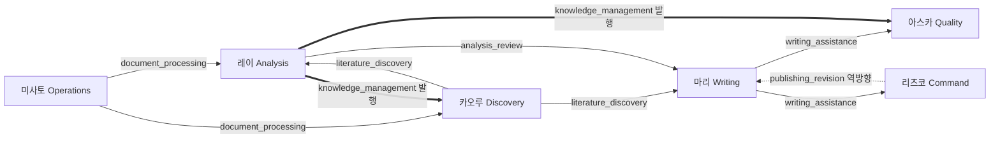

# 교차 시스템 · Handoff Schema

NERV의 7개 역할(캐릭터)은 각자 닫힌 도메인을 책임지지만, 연구 워크플로우는 결국 역할의 경계를 넘나든다. 미사토가 변환한 문서는 레이가 분석하고, 카오루가 발굴한 문헌은 마리가 글로 옮기며, 마리의 초안은 아스카의 검토를 거친다. 이 **역할 간 산출물 전달**을 통제하는 단일 계약이 핸드오프 스키마(`Agents/HANDOFF_SCHEMA.yaml`, **v2.1**)다.

핸드오프 스키마의 핵심 원칙은 셋이다.

- **모든 역할 간 전달은 정의된 유형 중 하나를 따른다.** 자유 형식의 임의 전달은 없다.
- **각 유형은 필수 필드를 가진다.** 발신 측은 채우고, 수신 측은 검증한다.
- **필수 필드가 누락되면 수신 측은 반려할 수 있다.** 반려는 기록되고, 누적되면 상위로 에스컬레이션된다.

---

## 8가지 canonical 핸드오프 유형

각 유형은 **생산자(producer)** 역할 하나와 **소비자(consumer)** 역할 여럿으로 라우팅된다. 아래는 NERV의 표준 8종이다.

| 핸드오프 유형 | 생산자 → 소비자 | 의미 |
|---|---|---|
| `document_processing_output` | 미사토 → 레이, 카오루 | 문서 변환 산출물(변환된 마크다운, 메타데이터, 품질 정보) 전달 |
| `literature_discovery_output` | 카오루 → 레이, 마리, 아스카, 신지 | 문헌 탐색 결과(핵심 논문, 상충 견해, 한계, 후속 질문) 전달 |
| `analysis_review_output` | 레이 → 마리 | 논문 분석 결과(요약, 방법론 분석, 연구 갭) 전달 |
| `writing_assistance_output` | 마리 → 아스카, 리츠코 | 원고 초안(섹션별 상태, 품질 점검 결과) 전달 |
| `publishing_revision_output` | 리츠코 → 마리 | **역방향** — 리뷰 결과를 글쓰기 역할로 되돌려 수정 요청 |
| `knowledge_management_output` | 레이 → 전체 역할 | 지식 데이터(태그, 링크 등)를 모든 역할에 **발행** |
| `research_planning_output` | 리츠코 → 카오루, 미사토, 마리, 레이, 신지 | 연구 기획 산출물(연구 질문, 작업 지시)을 다수 역할에 전달 |
| `expert_system_output` | 신지 → 마리, 레이, 리츠코 | 전문가 조회 결과(측정 전략, 실험 설계 권장)를 전달 |

### 카오루 탐색 하위 계약 2종

위 8종이 역할 간 canonical 핸드오프라면, 카오루의 탐색 파이프라인은 그래프·시계열 전용 산출을 위한 두 개의 추가 계약을 둔다. 두 유형 모두 카오루가 생산하며, 다중 소비자로 라우팅된다.

| 핸드오프 유형 | 생산자 → 소비자 | 의미 |
|---|---|---|
| `citation_network_output` | 카오루 → 레이, 마리, 아스카 | 인용 네트워크 분석 결과(중심성 지표, 클러스터, 핵심 논문) 전달 |
| `research_trend_output` | 카오루 → 레이, 마리, 리츠코 | 연구 분야 시계열 트렌드 분석 결과(연도별 추이, 신흥 주제, 핵심 저자) 전달 |

---

## 핸드오프 흐름

전형적인 연구 흐름은 미사토에서 시작해 분석·발굴 역할을 거쳐 글쓰기로 모이고, 다시 품질·관리 역할로 빠져나간다. 레이는 그와 별도로 지식 데이터를 전 역할에 발행한다.

실선은 정방향 핸드오프, 점선은 리뷰 결과를 글쓰기로 되돌리는 역방향 루프, 굵은 선은 레이가 지식 데이터를 발행-구독으로 흘려보내는 경로를 나타낸다.

---

## 발행-구독 모델

`knowledge_management_output`은 특수한 형태다. 하나의 소비자를 지정하는 대신, 레이가 산출한 지식 데이터를 **모든 역할이 구독할 수 있는 공유 공간**에 발행한다.

- **발행 주체**: 레이(Analysis & Knowledge)
- **발행 위치**: `Research/.shared/` (태그는 `tags/`, 링크는 `links/` 등 데이터 종류별 하위 경로)
- **소비**: 각 역할이 자신의 역할 정의서에 구독 선언을 명시하고, 필요한 데이터를 가져간다

발행은 아무 때나 일어나지 않고 **트리거**에 따른다.

| 트리거 | 발행 시점 |
|---|---|
| `batch_complete` | 배치 작업(예: 태그 일괄 부여)이 완료되었을 때 |
| `taxonomy_update` | 분류 체계(taxonomy)가 갱신되었을 때 — 이 경우 검증 등급이 한 단계 상향된다 |
| `on_demand` | 명시적 요청이 있을 때 |

발행-구독 모델은 N개 역할이 서로를 직접 호출하는 N×N 결합을 피하고, 레이를 단일 발행 지점으로 두어 지식의 흐름을 한 방향으로 정렬한다.

---

## 필수 필드 검증과 반려

핸드오프 스키마는 단순한 데이터 형식 정의가 아니라 **계약**이다. 발신·수신 양측에 체크리스트가 정의되어 있다.

- **발신 체크리스트**: 필수 필드가 모두 채워졌는가, 품질 게이트를 통과했는가, 산출물이 지정 경로에 저장되었는가, 메타데이터가 스키마와 일치하는가
- **수신 체크리스트**: 필수 필드가 모두 존재하는가, 품질 점수가 기준 이상인가, 수동 검토 플래그가 있는가, 데이터 형식이 예상과 일치하는가

수신 측 검증이 다음 중 하나에 걸리면 핸드오프는 **반려**된다.

- 필수 필드 누락(`missing_required_fields`)
- 품질 기준 미달(`quality_below_threshold`)
- 데이터 형식 불일치(`data_format_mismatch`)
- 분석 미완(`incomplete_analysis`)

반려는 조용히 사라지지 않는다. 모든 반려는 표준 포맷(반려 역할, 일시, 사유, 누락 항목, 요청 사항, 재제출 기한)으로 기록되며, 처리 절차는 다음과 같다.

- **로깅**: `Agents/.logs/handoff-rejections/`에 기록
- **통보**: 발신 역할에 알림
- **에스컬레이션**: 동일 핸드오프가 **2회 반려**되면 Lab Director로 상향

이 반려 프로토콜이 있기 때문에, 품질 미달 산출물이 파이프라인을 따라 조용히 흘러 내려가다 출판 직전에야 발견되는 사고를 구조적으로 막는다. 각 경계마다 필수 필드라는 명시적 관문이 서 있다.

---

## 품질 게이트와 단계 정책

핸드오프마다 품질 게이트가 붙고, 게이트 미달 시 동작은 작업 단계에 따라 달라진다. 탐색 단계는 관대하고, 출판 단계는 엄격하다.

| 단계 | 정책 | 동작 |
|---|---|---|
| `explore` (탐색) | `warn_and_continue` | 경고 후 계속 |
| `produce` (생산) | `warn_and_flag` | 경고 + 수동 검토 플래그 설정 |
| `publish` (출판) | `block` | 차단 |

특히 출판 경로에 놓인 `writing_assistance_output`과 역방향인 `publishing_revision_output`은 가장 높은 검증 등급을 강제받는다. 이 두 유형은 MAGI 교차검증을 필수로 통과해야 하며, 그 자세한 메커니즘은 [MAGI Gate](magi-gate.md) 페이지에서 다룬다.

---

핸드오프 스키마는 NERV가 "역할별로 잘 작동하는 에이전트 모음"에 그치지 않고 **하나의 연구 시스템**으로 동작하게 만드는 결합 조직이다. 각 역할은 자기 도메인만 책임지되, 도메인을 넘는 순간에는 모두가 같은 계약을 따른다.
