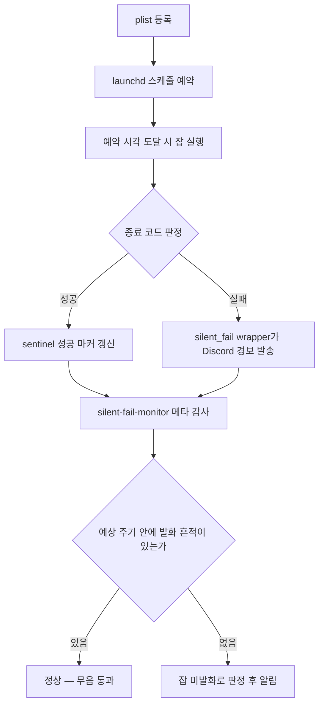

# 교차 시스템 · launchd 운영

NERV는 사람이 매번 손으로 실행하지 않아도 되는 정기 작업들을 macOS launchd로 예약해 자동으로 굴린다. 논문 추천, 라이브러리 건강 점검, 자율 순찰, 콘텐츠 발행, 인증 토큰 갱신 같은 운영 작업이 정해진 주기에 맞춰 스스로 돌아간다. 이렇게 등록된 자동화 잡은 현재 **42개**다.

잡 개수는 다음 한 줄로 언제든 검증할 수 있다.

```bash
ls ~/Library/LaunchAgents/com.nerv.*.plist | wc -l   # → 42
```

이 숫자가 곧 SSOT(단일 진실 공급원)다. 잡을 새로 등록하거나 폐지하면 이 명령의 출력이 바뀌고, 문서·모니터·인벤토리의 카운트가 모두 같은 값을 가리키도록 동기화한다.

## 카테고리별 잡 구성

42개 잡은 실행 주기에 따라 일곱 갈래로 나뉜다.

| 카테고리 | 카운트 | 성격 |
|---|---|---|
| KeepAlive | 6 | 항상 떠 있어야 하는 상주 데몬 (죽으면 자동 재기동) |
| Interval (≥1800초) | 2 | 30분 이상 간격의 주기 실행 |
| Interval (300초) | 1 | 5분 간격의 잦은 점검 |
| Daily (single) | 12 | 하루 한 번 정해진 시각에 실행 |
| Daily (multi-cal) | 1 | 하루 안에 여러 시각으로 분산 실행 |
| 2×daily (multi-cal) | 2 | 하루 두 번 실행 |
| Weekly | 18 | 주 단위 실행 (요일·시각 지정) |
| **합계** | **42** | |

- **KeepAlive 6개**는 상시 떠 있어야 하는 데몬이다. Discord 봇, 파일 감시기, 동기화 파이프라인, 대시보드, 에이전트 모니터 등이 여기에 속하며, 프로세스가 종료되면 launchd가 다시 띄운다.
- **Interval 계열 3개**는 시간 간격 기반으로 반복한다. 가장 잦은 잡은 5분 간격의 라이브러리 생존 점검이다.
- **Daily 계열 13개**는 하루 한 번(또는 하루 안에 여러 시각으로) 도는 잡으로, 일일 논문 추천·다이제스트·콘텐츠 발행·건강 점검 등이 모여 있다.
- **Weekly 18개**는 주 단위 점검·정리 작업이 가장 많은 군집이다. 코드 린팅, 스키마 점검, 위키 보강, 메모리 정리 같은 주간 유지보수가 여기에 들어간다.

## 안정성 인프라

자동화 잡이 많아질수록 "조용히 죽는" 잡이 생기는 것이 가장 큰 위험이다. 잡이 실패해도 아무도 모르면 장애가 누적된다. NERV는 이를 막기 위해 세 겹의 안전망을 둔다.

### 1. silent_fail wrapper

cron 성격의 잡은 실행 래퍼(`silent_fail_alert.sh`)로 감싸서, 잡이 비정상 종료하면 즉시 Discord로 경보를 보낸다. 현재 **19개 잡**에 이 래퍼가 적용되어 있다. 단, 상주 데몬이나 5분 미만 간격의 잡, 그리고 이미 자체 알림 메커니즘을 갖춘 잡(자율 순찰 등)은 중복 회피를 위해 적용 대상에서 제외한다.

### 2. silent-fail-monitor — 메타 감사

래퍼는 "잡이 실행됐는데 실패한 경우"를 잡는다. 그런데 그보다 더 음험한 실패가 있다. **잡 자체가 아예 발화하지 않는 경우**다. 등록이 풀렸거나, plist가 삭제됐거나, 재부팅 후 다시 등록되지 않았을 때가 그렇다.

이를 잡기 위해 매일 **23:55(KST)**에 메타 감사 잡(`silent-fail-monitor`)이 돈다. 각 잡이 마지막으로 성공한 시각을 추적하다가, 예상 주기를 넘기도록 발화 흔적이 없으면 "이 잡이 죽었다"고 판정해 알린다. 잡들을 감시하는 잡 위에, 그 감시 잡 자신의 건강까지 점검하는 자기진단(self-health) 층이 한 겹 더 올라가 있다.

### 3. 잡 신규 등록 SOP

새 잡을 추가할 때 안전망에서 누락되는 일을 막기 위해, 표준 등록 절차(SOP)를 따른다. 핵심은 네 가지를 빠짐없이 채우는 것이다.

1. **plist 작성** — 절대 경로와 환경 변수, 로그 출력 경로를 갖춘 표준 패턴으로 잡을 정의한다.
2. **wrapper 적용** — cron 성격의 잡이면 silent_fail 래퍼로 감싸고, 래퍼를 쓰지 않는 직접 호출 잡이면 성공 시 sentinel(성공 마커)을 갱신하는 코드를 넣는다.
3. **monitor 매핑** — silent-fail-monitor에 "주기 임계값"을 등록하거나, 감시 부적합 잡이면 면제 목록에 올린다. 둘 중 하나에 반드시 들어가야 하며, 양쪽 모두에 없으면 monitor가 드리프트로 자동 감지해 경고한다.
4. **lint pass** — 잡 린터로 회귀 검사를 돌려 plist 구성 결함(프로세스 그룹 처리 누락 등)이 없는지 확인한 뒤 통과시킨다.

이 절차 덕분에 잡이 늘어나도 "감시되지 않는 잡"이 생기지 않는다. SOP 자체가 누락을 monitor가 self-detect하도록 설계되어 있어, 사람이 한 단계를 빠뜨려도 시스템이 그것을 잡아낸다.

## 운영 잡 예시

연구 데이터와 무관한 시스템·운영 성격의 잡 몇 가지를 기능 수준에서 소개한다.

| 잡 | 주기 | 기능 |
|---|---|---|
| `magi-patrol` | 하루 여러 회 | 설정·스키마·문서·코드 정합성을 점검하는 자율 순찰 |
| `github-hunter` | 주간 | 외부 GitHub 저장소를 탐색·평가해 도입 후보를 선별 |
| `expert-digest` | 매일 | 전문 분야 자료를 정리한 다이제스트 발행 |
| `library-health` | 매일·주간 | 라이브러리 정합성 점검 및 건강 리포트 |
| `photocard` | 매일 | 캐릭터 포토카드 콘텐츠 생성·발행 |
| `webtoon` | 하루 두 회 | 4컷 메타 코미디 웹툰 생성·연재 |
| `claude-keepalive` | 30분 간격 | 인증 토큰을 주기적으로 갱신해 세션 끊김 방지 |

이 잡들은 각각 알림·발행·점검 등 자기 역할을 자동으로 수행하며, 실패하면 위의 안정성 인프라가 이를 표면화한다. 예컨대 `claude-keepalive`는 30분마다 인증을 갱신해 봇과 파이프라인이 만료된 자격 증명으로 실패하는 일을 미연에 막는다.

## 잡 생명주기

잡 하나가 등록부터 실행, 그리고 성공/실패 처리까지 거치는 흐름은 다음과 같다.



잡이 등록되면 launchd가 스케줄에 따라 예약하고, 정해진 시각이 오면 실행한다. 성공하면 sentinel 마커를 갱신해 "이 잡은 방금 잘 돌았다"는 흔적을 남기고, 실패하면 래퍼가 즉시 경보를 보낸다. 그리고 하루 끝의 메타 감사가 각 잡의 발화 흔적을 모아 점검하여, 흔적이 있으면 조용히 통과시키고 흔적이 없으면 "이 잡이 죽었다"고 판정해 알린다. 세 겹의 안전망이 직렬로 맞물려, 한 단계를 빠져나가더라도 다음 단계가 받아내는 구조다.

## 함께 보기

- [MAGI Patrol](magi-patrol.md) — 24시간 자율 순찰 체계
- [MAGI Gate](magi-gate.md) — 역할 간 핸드오프 교차 검증
- [시스템 아키텍처](../02-architecture.md) — 전체 시스템 구성
