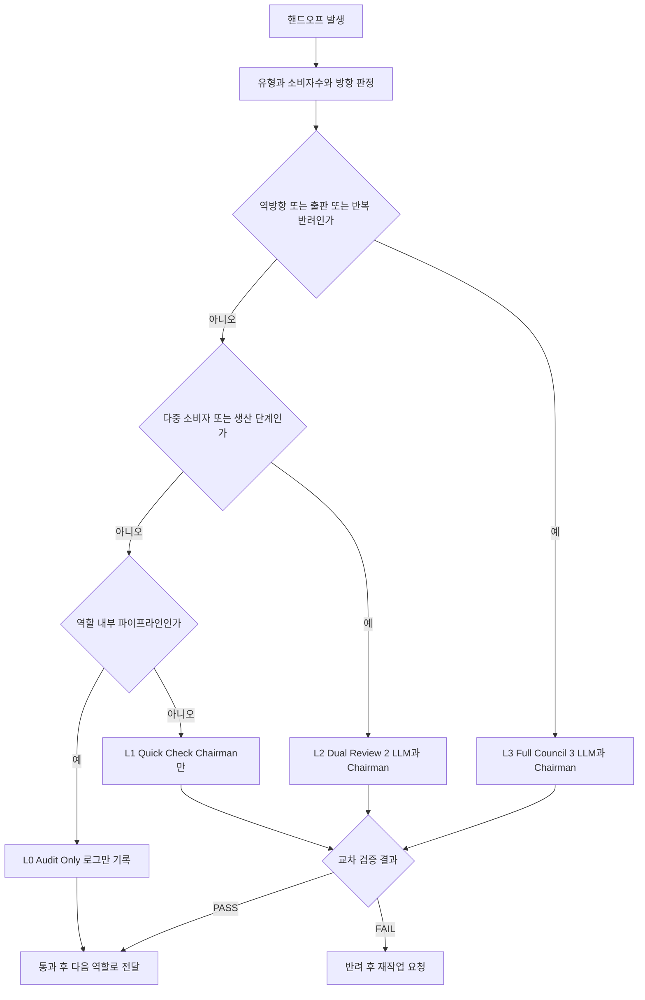

# MAGI Gate · 자율 교차 검증

MAGI Gate는 역할 간 데이터가 넘어갈 때(핸드오프) 그 산출물을 3대 LLM이 교차 검증하도록 등급을 정의하는 **설계 계약(design contract)**이다. 검증 강도는 핸드오프의 위험도에 따라 L0부터 L3까지 4단계로 나뉜다. 위험이 큰 산출물(출판용 글, 역방향 수정 요청, 반복 반려된 작업)일수록 더 많은 LLM이 합의에 참여한다.

!!! warning "현황 — 자동 게이트는 현재 미구현"
    자동 핸드오프 게이트(L0–L3 자율 개입)는 **현재 미구현**이며 설정상 비활성 상태(`magi_gate.enabled: false`)다. 아래의 등급/매핑 표는 **설계 계약(design contract)**으로 이해해야 한다. 실제 LLM 교차검증은 두 경로로 수행된다.

    - **magi-patrol** — 24시간 자율 순찰. 설정·스키마·문서·코드 정합성을 정기적으로 점검한다.
    - **agent-council** — PI가 명시적으로 호출하는 MAGI 합의. 3대 LLM이 병렬 검토 후 의장이 합의를 도출한다.

    자동 게이트(`enabled: true`) 복원은 실행기(executor) 구현 이후 PI가 결정할 사항이다.

## MAGI 구성

MAGI는 세 개의 독립적인 대형 언어 모델과 의장(Chairman)으로 구성된다.

| 구성원 | 역할 |
|---|---|
| Claude (MELCHIOR) | 1차 검증자 |
| Codex / gpt-5.5 (CASPAR) | 2차 검증자 |
| Gemini (BALTHASAR) | 3차 검증자 |
| **Chairman** | 검증 결과를 종합해 통과/반려를 판정하는 의장 |

세 모델이 서로 다른 관점에서 산출물을 검토하고, 의장이 그 결과를 모아 최종 결정을 내린다. 검증 등급에 따라 참여하는 모델 수가 달라진다.

## 4단계 검증 등급

| 등급 | 참여 LLM 수 | 적용 대상 |
|---|---|---|
| **L3** Full Council | 3 + Chairman | 출판(publish), 역방향 핸드오프, 반복 반려 |
| **L2** Dual Review | 2 + Chairman | 생산(produce), 다중 소비자, 주요 Phase 전환 |
| **L1** Quick Check | Chairman only | 탐색(explore), 단일 소비자 |
| **L0** Audit Only | 로그만 기록 | 역할 내부 파이프라인 |

- **L3 Full Council** — 가장 엄격한 검증. 세 모델 전원과 의장이 참여하며, 출판물처럼 외부로 나가는 산출물이나 한번 반려된 작업을 다시 올릴 때 적용한다.
- **L2 Dual Review** — 두 모델과 의장이 참여한다. 생산 단계 산출물이나 여러 역할이 동시에 소비하는 데이터에 적용한다.
- **L1 Quick Check** — 의장만 빠르게 점검한다. 탐색 단계나 단일 소비자로 위험이 낮을 때 쓴다.
- **L0 Audit Only** — 별도 검증 없이 로그만 남긴다. 한 역할 안에서 도는 내부 파이프라인에 적용한다.

## 핸드오프별 기본 등급

각 핸드오프 유형은 기본 검증 등급을 가진다. 조건에 따라 등급이 상향(승급)될 수 있다.

| 핸드오프 | 기본 등급 | 비고 |
|---|---|---|
| `writing_assistance_output` | **L3** 필수 | MAGI PASS만 통과 |
| `publishing_revision_output` | **L3** 필수 | 역방향 = 항상 Full Council |
| `literature_discovery_output` | L2 | 다중 소비자 |
| `analysis_review_output` | L2 | 재현성 검증 |
| `research_planning_output` | L2 | action 모드 → L3 승급 |
| `expert_system_output` | L2 | 실험 설계 변경 → L3 승급 |
| `document_processing_output` | L1 | 품질 점수 미달 시 → L2 승급 |
| `knowledge_management_output` | L1 | taxonomy 변경 → L2 승급 |

핵심 원칙은 두 가지다. 첫째, **출판용 글쓰기와 역방향 수정**은 무조건 L3 Full Council을 거친다. 외부로 나가거나 이미 한 번 돌아온 산출물은 최고 강도로 검증한다는 뜻이다. 둘째, 기본 등급이 낮더라도 **위험 신호가 감지되면 등급이 자동으로 올라간다**. 예컨대 연구 계획이 단순 탐색이 아니라 실제 실행(action)을 지시하거나, 문서 변환 품질 점수가 기준에 미달하면 한 단계 위로 승급한다.

## 등급 결정 흐름

핸드오프가 발생하면 그 유형, 소비자 수, 방향을 판정해 적절한 등급을 배정하고, 해당 강도로 교차 검증한 뒤 통과 또는 반려를 결정한다.

## 함께 보기

- [Handoff Schema](handoff.md) — 역할 간 데이터 교환 규칙과 핸드오프 유형 정의
- [시스템 아키텍처](../02-architecture.md) — 전체 시스템 구성
