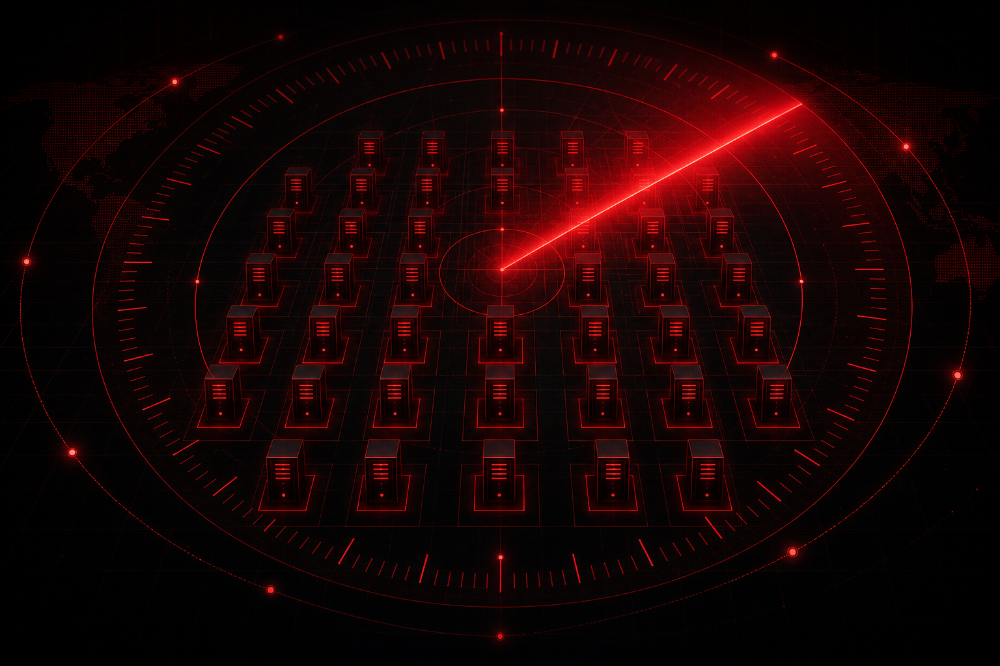
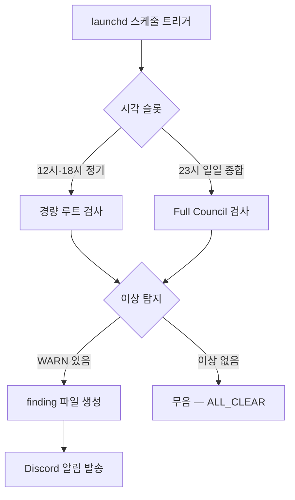

# MAGI Patrol — 24시간 자율 순찰

MAGI Patrol은 NERV 시스템을 사람의 개입 없이 정기적으로 점검하는 자율 순찰 체계다. 설정 파일 정합성, 스키마 드리프트, 코드 품질, 문서 일관성 등 시스템 곳곳을 정해진 주기로 훑으며, 이상이 감지된 경우에만 알림을 남긴다. 평소에는 조용하고, 문제가 있을 때만 목소리를 내는 것이 이 체계의 핵심이다.

## 순찰 스케줄

순찰은 macOS launchd로 예약되어 자동 실행된다.

| 구분 | 시각 (KST) | 성격 |
|------|-----------|------|
| 정기 순찰 | 12:00 · 18:00 | 6시간 간격의 경량 점검 |
| 일일 종합 | 23:00 | 하루를 마감하는 전수 점검 (Full Council) |

순찰 결과를 기록하는 finding 파일은 **이상이 탐지된 경우(WARN)에만** 생성된다. 따라서 특정 슬롯에 finding 파일이 없는 것은 누락이 아니라 정상 상태(ALL_CLEAR)의 무음 신호다. "조용함 = 건강함"이 기본값이며, 알림이 떴을 때만 들여다보면 된다.

## 모델 배정

순찰 단계별로 비용과 깊이의 균형을 맞춰 LLM을 배정한다.

| 단계 | 모델 구성 | 비고 |
|------|-----------|------|
| 정기 순찰 (6시간) | Opus (medium) + Codex (medium) | 코드·설정 위주의 경량 점검 |
| 일일 종합 (23:00) | Opus (high) + gpt-5.5 (medium) + Gemini | 3대 LLM Full Council |

정기 순찰은 가벼운 점검이므로 2개 모델로 빠르게 돌고, 하루 한 번의 일일 종합만 3대 LLM이 모두 참여하는 Full Council로 깊게 검증한다.

## 순찰 루트 9개

각 루트는 점검 대상이 다르며, 위 스케줄의 슬롯에 분산 배치되어 있다.

| 루트 | 슬롯 (KST) | 검사 대상 |
|------|-----------|-----------|
| `config_consistency` | 12:00 · 18:00 | 설정 파일 간 정합성 |
| `schema_drift` | 12:00 | 핸드오프 스키마 드리프트 |
| `code_quality` | 12:00 | 하드코딩 · 보안 · 데드코드 |
| `doc_consistency` | 18:00 | 문서 간 버전 · 내용 일치 |
| `skill_health` | 18:00 | 스킬 파일 건강 (정의 ↔ 에이전트 정합) |
| `uncommitted_check` | 18:00 | Git 작업 위생 (미커밋 · 미추적 누적) |
| `daily_audit` | 23:00 | 종합 건강 점검 (Full Council) |
| `research_progress` | 23:00 | 마감일 · 정체 프로젝트 |
| `wiki_health` | 23:00 | Knowledge Wiki 정합성 · 건강도 |

`config_consistency`는 12시·18시 양쪽에서 가장 자주 점검되며, 무거운 종합 루트(`daily_audit`, `research_progress`, `wiki_health`)는 일일 종합 슬롯에 모아 둔다.

## 순찰 흐름

스케줄이 트리거되면 시각에 따라 경량 루트 또는 Full Council 검사가 실행된다. 점검 결과 이상이 발견되면 finding 파일이 생성되고 Discord로 알림이 발송되며, 이상이 없으면 어떤 파일도 남기지 않고 조용히 종료한다. 이 무음 종료가 시스템이 건강하다는 가장 흔한 신호다.
