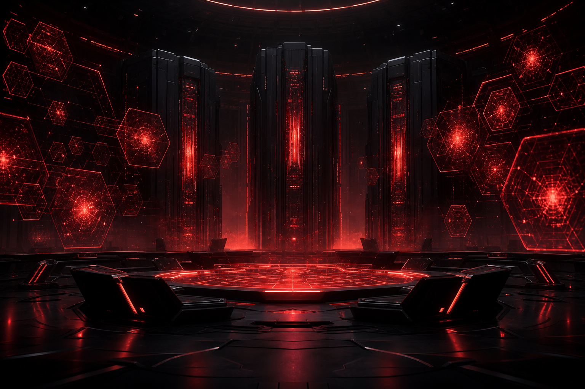

# NERV 시스템 백서

> **NERV**는 1인 연구실(PI)의 학술 연구를 자동화·증폭하는 **45개 에이전트 멀티에이전트 시스템**입니다.
> 에반게리온의 특무기관 *NERV*와 3대 슈퍼컴퓨터 *MAGI*를 모티프로, **7명의 캐릭터(역할)**가 에이전트를 소유하고
> Discord 봇이 디스패치하며, MAGI 사상의 **자율 교차검증**으로 품질을 지킵니다.

!!! note "한눈에"
    - **45 에이전트** = 38 Claude 서브에이전트 + 7 Python 파이프라인
    - **7 캐릭터(역할)** = 리츠코 · 미사토 · 레이 · 아스카 · 카오루 · 마리 · 신지
    - **모델 전략** = Opus 4.8 / Sonnet 4.6 / Haiku 4.5 + Codex(gpt-5.5) 강제위임 16
    - **자율 운영** = MAGI Gate · MAGI Patrol(24h 순찰) · launchd 42 잡

## 이 백서는

NERV의 **아키텍처와 운영 철학**을 외부 독자가 읽고 검증할 수 있도록 정리한 기술 백서입니다.
38개 서브에이전트 각각의 작동 방식을 **플로우차트(Mermaid)**로 전수 수록하고,
교차 시스템(핸드오프·MAGI·품질 게이트·launchd)과 모델 전략을 다룹니다.

> 본 백서는 시스템 *구조*만 기술합니다. 진행 중인 연구의 데이터·결과·참가자 정보 등은 포함하지 않습니다.

## 목차

| 장 | 내용 |
|---|---|
| [1 · 개요 & 철학](01-overview.md) | 왜 멀티에이전트인가 · 캐릭터 소유 모델 · MAGI 사상 |
| [2 · 시스템 아키텍처](02-architecture.md) | 45 에이전트 전체 지도 · 레이어 구조 |
| [3 · 7 캐릭터(역할)](03-characters/index.md) | 역할 매트릭스 · 캐릭터별 도메인 |
| [4 · 서브에이전트 레퍼런스](04-agents/index.md) | **38 전수** · 각 플로우차트 + 입출력 계약 |
| [5 · Python 파이프라인](05-pipelines.md) | 미사토 6 + github-hunter 문서처리·발굴 |
| [6 · 교차 시스템](06-systems/magi-gate.md) | MAGI Gate · Patrol · Handoff · 품질 게이트 · launchd |
| [7 · 모델 전략](07-model-strategy.md) | 모델 배정 + Codex 강제위임 |
| [8 · 부록](08-appendix.md) | 용어집 · 45 인벤토리 · 검증 스크립트 |
